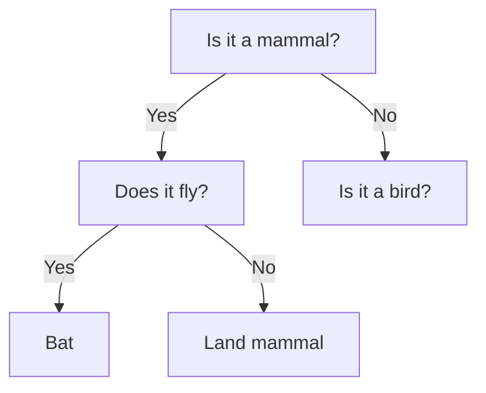

# Logical Deduction Tasks

Create deductive reasoning problems that require students to draw logical conclusions from given facts and rules. Problems should involve clear premises and require step-by-step logical thinking to reach valid conclusions.

**Vary the logical structure:**
- **Syllogisms**: "All A are B. C is an A. Therefore, C is ___" (e.g., All birds have feathers. A robin is a bird. Therefore...)
- **Transitive relationships**: "If A > B and B > C, what can we conclude about A and C?" (works with >, <, =, taller, faster, older, etc.)
- **Conditional statements**: "If it rains, the ground gets wet. The ground is wet. What can we conclude?" (careful with affirming the consequent!)
- **Process of elimination**: "The pet is either a cat, dog, or rabbit. It doesn't bark. It doesn't meow. What is it?"
- **Truth tables**: Simple logical AND/OR/NOT operations with 2-3 variables
- **Constraint satisfaction**: "Three people like different fruits. Alex doesn't like apples. Beth likes bananas. Who likes apples?"
- **Contradictions**: "Statement 1 says X. Statement 2 says not-X. What can we conclude?"

**Vary the content scenarios:**
- Detective mysteries (finding who committed an action based on clues)
- Animal classifications (mammals, birds, fish with specific traits)
- Sports tournaments (team rankings and match results)
- Scheduling problems (who meets when, based on constraints)
- Object properties (colors, sizes, positions)
- Family relationships (age comparisons, parent-child connections)
- Route finding (if you can't go through A, and B leads to C...)

**Vary the complexity:**
- For younger ages ({{age}} 9-11): 2-3 simple premises with direct conclusions, concrete scenarios
- For middle ages ({{age}} 12-14): 3-4 premises requiring 2-3 steps of reasoning, introduce necessity vs. sufficiency
- For older ages ({{age}} >= 14): 4-5 premises with complex chains, include logical fallacies to avoid, abstract concepts

**Use appropriate diagrams:**
- Create **Mermaid flowcharts** for decision trees:

- Use **tables** for organizing information:

| Person | Age | Favorite Color | Pet |
|--------|-----|----------------|-----|
| Alice  | 12  | ?              | Dog |
| Bob    | ?   | Blue           | ?   |
| Carol  | 10  | Red            | Cat |

**Presentation guidelines:**
- State all premises clearly before asking the question
- Use "Given:", "Fact 1:", "Fact 2:" format for clarity
- Ask students to identify what can be **definitely concluded** vs. what is **possible but not certain**
- Include questions that require students to explain their reasoning
- For younger students, offer multiple choice answers
- For older students, ask open-ended "What can you conclude?" questions

**Ensure variety:**
- Alternate between different logical structures
- Mix positive and negative statements ("All X are Y" vs. "No X are Y")
- Include some problems where the answer is "We cannot determine this from the given information"
- Vary the number of steps required to reach the conclusion
