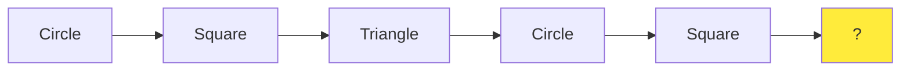

# Pattern Recognition Tasks

Create pattern recognition problems that help students identify, understand, and continue repeating sequences. Focus on both visual and conceptual patterns with clear, discoverable rules.

**Vary the pattern types:**
- **Simple alternating patterns**: "A, B, A, B, ___" using shapes, colors, or letters
- **ABAB vs. AABB patterns**: "Red, Red, Blue, Blue, Red, Red, ___"
- **Growing patterns**: "1 circle, 2 circles, 3 circles, ___" (visual or numerical)
- **ABC patterns**: "Triangle, Circle, Square, Triangle, Circle, ___"
- **Skip patterns**: Every other, every third element changes
- **Attribute patterns**: Objects that change one property at a time (color changes but shape stays same)
- **Symmetrical patterns**: Patterns that mirror or reflect (palindromic sequences)
- **Nested patterns**: Patterns within patterns (e.g., colors repeat every 3, shapes every 2)

**Vary the pattern elements:**
- Geometric shapes (circle, square, triangle, pentagon, hexagon)
- Colors (use emojis or Unicode: 🔴 🔵 🟢 🟡)
- Letters (A, B, C patterns or consonant/vowel patterns)
- Numbers (even/odd alternating, small/large alternating)
- Symbols (★, ♦, ●, ▲, ■)
- Days of the week or months
- Sizes (small, medium, large indicators)
- Orientations (↑, →, ↓, ←)

**Vary the complexity:**
- For younger ages ({{age}} < 10): Simple AB or AAB patterns with 2-3 elements, visual aids
- For middle ages ({{age}} 10-13): ABC or AABB patterns, 4-5 elements, mix visual and conceptual
- For older ages ({{age}} >= 13): Complex nested patterns, 5-6 elements, multiple attributes changing

**Use tables for clear presentation:**

| Position | 1 | 2 | 3 | 4 | 5 | 6 | ? |
|----------|---|---|---|---|---|---|---|
| Shape    | ○ | □ | △ | ○ | □ | △ | ? |
| Color    | 🔴| 🔵| 🔴| 🔵| 🔴| 🔵| ? |

**Use Mermaid for pattern visualization:**

**Question variations:**
- "What comes next?" (single element prediction)
- "What's missing?" (fill in gaps in the middle)
- "What's the rule?" (describe the pattern explicitly)
- "Continue the pattern for 3 more steps"
- "Which element doesn't fit the pattern?"
- "Create your own pattern using this rule: ___"

**Real-world connections:**
- Calendar patterns (days of week, months)
- Music rhythms (clap-clap-pause, clap-clap-pause)
- Tile floor designs (alternating colors/shapes)
- Nature patterns (leaf arrangements, flower petals)
- Traffic light sequences
- Dance steps or movement patterns

**Ensure variety:**
- Mix visual and abstract patterns
- Change the number of elements in the repeating unit
- Vary whether the pattern is shown left-to-right, top-to-bottom, or in a grid
- Include some patterns that break expectations (e.g., after ABABAB, suddenly introduce C)
- Use culturally neutral symbols and avoid text-heavy patterns for accessibility
