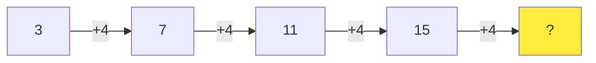

# Number Sequences Tasks

Create number sequence problems that help students recognize mathematical patterns and predict future values. Focus on building understanding of arithmetic and geometric progressions with clear, discoverable rules.

**Vary the sequence types:**
- **Arithmetic sequences (constant addition)**: "5, 8, 11, 14, ___" (+3 each time)
- **Arithmetic sequences (constant subtraction)**: "20, 17, 14, 11, ___" (-3 each time)
- **Geometric sequences (constant multiplication)**: "2, 6, 18, 54, ___" (×3 each time)
- **Geometric sequences (constant division)**: "64, 32, 16, 8, ___" (÷2 each time)
- **Square number sequences**: "1, 4, 9, 16, 25, ___" (1², 2², 3², 4², 5²...)
- **Fibonacci-style sequences**: "1, 1, 2, 3, 5, 8, ___" (each number is sum of previous two)
- **Alternating operations**: "1, 2, 4, 5, 7, 8, ___" (+1, +2, +1, +2...)
- **Two-step rules**: "1, 3, 4, 6, 7, 9, ___" (+2, +1, +2, +1...)

**Vary the numerical content:**
- Simple counting by intervals (2s, 5s, 10s)
- Odd numbers only (1, 3, 5, 7...)
- Even numbers only (2, 4, 6, 8...)
- Multiples of numbers (3, 6, 9, 12... or 7, 14, 21...)
- Powers of 2 (2, 4, 8, 16, 32...)
- Perfect squares (1, 4, 9, 16, 25...)
- Triangular numbers (1, 3, 6, 10, 15...)
- Counting backwards/descending sequences

**Vary the complexity:**
- For younger ages ({{age}} < 10): Simple +1, +2, +5, +10 patterns with small numbers (under 50)
- For middle ages ({{age}} 10-13): More complex arithmetic (+3, +7, -4), introduce doubling/halving, numbers up to 100
- For older ages ({{age}} >= 13): Geometric progressions, Fibonacci-style, multi-step patterns, larger numbers, negative numbers

**Use tables for visualization:**

| Position (n) | 1 | 2 | 3 | 4 | 5 | 6 | ? |
|--------------|---|---|---|---|---|---|---|
| Value        | 2 | 5 | 8 | 11| 14| 17| ? |
| Difference   |   | +3| +3| +3| +3| +3| ? |

**Use Mermaid for sequence flow:**

**Question variations:**
- "What are the next 3 numbers in the sequence?"
- "What is the 10th number in this sequence?" (for simple patterns)
- "What is the rule for this sequence?"
- "Fill in the missing numbers: 2, ___, 8, 11, ___, 17"
- "Which number doesn't belong? 2, 4, 6, 9, 10, 12"
- "Create a sequence that follows this rule: Start at 5, add 3 each time"

**Real-world contexts:**
- Skip counting for money (counting by 5s for nickels, 10s for dimes)
- Clock arithmetic (hours, minutes in 5-minute intervals)
- Age progressions (how old will someone be in 3 years, 5 years, 10 years?)
- Savings patterns (saving $5 per week - how much after 1, 2, 3 weeks?)
- Height measurements (plant growing 2cm per week)
- Population doubling (bacteria, rabbits)
- Distance counting (mile markers: 10, 15, 20, 25...)

**Special sequence types by age:**
- For {{age}} < 10: Stick to visual, concrete sequences with manipulatives implied
- For {{age}} 10-13: Introduce the concept of "nth term" informally
- For {{age}} >= 13: Can use algebraic notation like "2n + 1" to describe rules

**Ensure variety:**
- Mix increasing and decreasing sequences
- Vary the starting number (don't always start at 1 or 0)
- Change the step size/multiplier for each problem
- Include both positive and negative numbers for older students
- Occasionally include sequences with fractional or decimal steps for advanced students
- Mix whole number arithmetic with multiplication/division patterns
