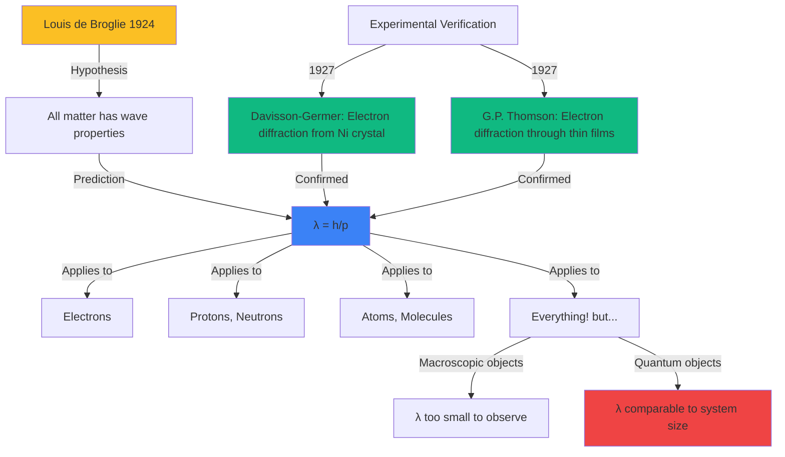
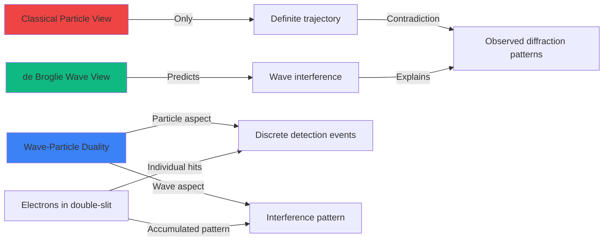

# Matter Waves Tasks

Create advanced physics problems that explore the wave nature of matter through de Broglie's hypothesis and electron diffraction. Problems should help students understand that wave-particle duality applies universally to all matter, calculate matter wavelengths, and recognize when quantum effects become observable.

**Vary the problem structure:**
- **de Broglie wavelength calculations**: Apply $\lambda = \frac{h}{p} = \frac{h}{m \cdot v}$ where $h$ is Planck's constant, $p$ is momentum, $m$ is mass, $v$ is velocity
- **Relativistic corrections**: For high velocities, use $p = \gamma m v$ where $\gamma = \frac{1}{\sqrt{1 - v^2/c^2}}$
- **Energy-wavelength relationship**: For particles with kinetic energy $E_{kin} = \frac{p^2}{2m}$, derive $\lambda = \frac{h}{\sqrt{2mE_{kin}}}$
- **Electron wavelength from voltage**: For electrons accelerated through potential $U$: $\lambda = \frac{h}{\sqrt{2m_e e U}}$ where $e$ is elementary charge
- **Comparing matter wavelengths**: Calculate and compare wavelengths for electrons, protons, neutrons, atoms, molecules, macroscopic objects
- **Electron diffraction analysis**: Apply Bragg's law $n\lambda = 2d\sin\theta$ for crystal diffraction, similar to X-ray diffraction
- **Double-slit with electrons**: Use same interference equations as light: $d\sin\theta = n\lambda$ but with matter wavelength
- **Wave packet analysis**: Discuss relationship between momentum uncertainty and wavelength, spatial extent of matter waves
- **Quantitative duality**: Show that matter wavelength becomes negligible for macroscopic objects ($\lambda \ll$ object size)
- **Historical verification**: Davisson-Germer experiment (1927), G.P. Thomson's electron diffraction (1927)

**Vary the content/context:**
- **Electron diffraction**: Electrons through thin metal foils or crystals, electron diffraction patterns showing wave interference
- **Transmission electron microscopy (TEM)**: Using electron matter waves for ultra-high resolution imaging beyond optical microscope limits
- **Neutron diffraction**: Neutrons as probes for crystal structures, magnetic structures (neutrons have magnetic moment)
- **Atomic/molecular beams**: He atoms, C60 fullerenes, large molecules showing interference - extending quantum behavior to larger objects
- **Quantum particles**: Electrons in atoms, protons, neutrons, alpha particles all exhibit wave properties
- **Macroscopic comparison**: Calculate wavelengths for everyday objects (tennis ball, car, human) to show why quantum effects invisible
- **Technology applications**: Scanning electron microscopy (SEM), low-energy electron diffraction (LEED), electron holography
- **Fundamental physics**: Matter wave interferometry for precision measurements, quantum sensors using atom interferometers

**Vary the complexity based on age:**
- **For younger ages** ({{age}} < 18): Basic de Broglie wavelength calculations for electrons, understand duality concept, qualitative electron diffraction
- **For middle ages** ({{age}} 18): Quantitative electron diffraction problems, wavelength from accelerating voltage, compare different particles, dimensional analysis
- **For older ages** ({{age}} >= 19): Relativistic matter waves, advanced diffraction analysis, wave packet concepts, quantitative duality arguments, experimental design considerations

**Use appropriate formats:**

**LaTeX for formulas:**
- Inline for relationships: de Broglie wavelength $\lambda = \frac{h}{p}$, momentum $p = m \cdot v$
- Block for fundamental equations:

**de Broglie wavelength (general):**
$$\lambda = \frac{h}{p} = \frac{h}{m \cdot v}$$

where:
- $h = 6.626 \times 10^{-34}$ J·s (Planck's constant)
- $p$ = momentum (kg·m/s)
- $m$ = mass (kg)
- $v$ = velocity (m/s)

**de Broglie wavelength from kinetic energy:**

Non-relativistic ($v \ll c$): $E_{kin} = \frac{1}{2}mv^2 = \frac{p^2}{2m}$

$$\lambda = \frac{h}{\sqrt{2mE_{kin}}}$$

**Electron wavelength from accelerating voltage:**
$$\lambda_e = \frac{h}{\sqrt{2m_e e U}}$$

where:
- $m_e = 9.109 \times 10^{-31}$ kg (electron mass)
- $e = 1.602 \times 10^{-19}$ C (elementary charge)
- $U$ = accelerating voltage (V)

**Numerical formula for electron wavelength:**
$$\lambda_e \approx \frac{1.23 \text{ nm}}{\sqrt{U[\text{V}]}}$$

**Bragg's law for matter wave diffraction:**
$$n\lambda = 2d\sin\theta$$

where:
- $n = 1, 2, 3, ...$ (order of diffraction)
- $d$ = lattice spacing (m)
- $\theta$ = diffraction angle

**Double-slit interference (matter waves):**
$$d\sin\theta_m = m\lambda \quad (m = 0, \pm 1, \pm 2, ...)$$

Same formula as light, but $\lambda$ is the de Broglie wavelength.

**Relativistic momentum (when $v$ approaches $c$):**
$$p = \gamma m v = \frac{m v}{\sqrt{1 - v^2/c^2}}$$

$$\lambda = \frac{h}{\gamma m v}$$

**Tables for particle properties:**

| Particle | Rest Mass $m$ (kg) | Rest Mass (u) | Rest Energy (MeV) |
|----------|-------------------|---------------|------------------|
| Electron | 9.109 × 10⁻³¹ | 0.000549 | 0.511 |
| Proton | 1.673 × 10⁻²⁷ | 1.007 | 938.3 |
| Neutron | 1.675 × 10⁻²⁷ | 1.009 | 939.6 |
| Alpha (⁴He²⁺) | 6.645 × 10⁻²⁷ | 4.003 | 3728 |
| He atom | 6.646 × 10⁻²⁷ | 4.003 | - |

**Typical electron wavelengths:**

| Accelerating Voltage $U$ (V) | Kinetic Energy (eV) | Wavelength $\lambda$ (nm) | Application |
|------------------------------|---------------------|--------------------------|-------------|
| 10 | 10 | 0.39 | Low energy diffraction |
| 50 | 50 | 0.17 | LEED surface analysis |
| 100 | 100 | 0.12 | Crystal structure |
| 1,000 | 1,000 | 0.039 | Electron diffraction |
| 10,000 | 10,000 | 0.012 | TEM imaging |
| 100,000 | 100,000 | 0.0037 | High-resolution TEM |
| 1,000,000 | 1,000,000 | 0.00087 | Ultra-high resolution |

**Matter wavelengths at room temperature:**

For thermal velocity at $T = 300$ K: $E_{kin} = \frac{3}{2}k_B T \approx 0.039$ eV

| Particle | Thermal velocity (m/s) | de Broglie wavelength (nm) |
|----------|----------------------|---------------------------|
| Electron | ~10⁵ | ~7 |
| Proton | ~2500 | ~0.16 |
| He atom | ~1400 | ~0.10 |
| N₂ molecule | ~500 | ~0.03 |

**Macroscopic object wavelengths (showing quantum invisibility):**

| Object | Mass (kg) | Velocity (m/s) | Wavelength (m) |
|--------|-----------|----------------|---------------|
| Dust particle | 10⁻⁹ | 0.001 | 6.6 × 10⁻²² |
| Bacterium | 10⁻¹⁵ | 0.0001 | 6.6 × 10⁻¹⁵ |
| Tennis ball | 0.057 | 30 | 3.9 × 10⁻³⁴ |
| Car | 1000 | 25 | 2.6 × 10⁻³⁸ |
| Human | 70 | 1 | 9.5 × 10⁻³⁶ |

These wavelengths are immeasurably small - many orders of magnitude smaller than any observable scale.

**Mermaid diagrams for matter wave concepts:**





**SVG diagrams for matter wave visualization:**

Use SVG to show:
- Electron diffraction setup: electron beam, crystal lattice or thin film, diffraction pattern on screen
- Comparison of wavelengths: electron vs. proton vs. macroscopic object at same velocity
- Davisson-Germer experiment schematic: electron gun, nickel crystal, detector at various angles
- Double-slit with electrons: similar to optical double-slit but with matter waves
- Graph showing wavelength vs. velocity for different particles
- Energy level diagram showing electron acceleration through potential difference
- Interference pattern buildup: single electrons arriving one at a time building up interference

Example SVG for electron diffraction:
```svg
<svg viewBox="0 0 600 400" xmlns="http://www.w3.org/2000/svg">
  <!-- Electron gun -->
  <rect x="30" y="180" width="80" height="40" fill="#6b7280" stroke="black" stroke-width="2"/>
  <text x="40" y="205" font-size="12" fill="white">e⁻ gun</text>
  <text x="35" y="240" font-size="10">Voltage U</text>

  <!-- Electron beam -->
  <line x1="110" y1="200" x2="250" y2="200" stroke="#3b82f6" stroke-width="3"/>
  <circle cx="150" cy="200" r="3" fill="#3b82f6"/>
  <circle cx="180" cy="200" r="3" fill="#3b82f6"/>
  <circle cx="210" cy="200" r="3" fill="#3b82f6"/>
  <text x="140" y="180" font-size="11" fill="#3b82f6">λ = h/√(2m_e eU)</text>

  <!-- Crystal lattice -->
  <rect x="250" y="140" width="60" height="120" fill="#e5e7eb" stroke="black" stroke-width="2"/>
  <text x="255" y="130" font-size="12">Crystal</text>

  <!-- Lattice structure (simplified grid) -->
  <circle cx="265" cy="160" r="4" fill="#374151"/>
  <circle cx="285" cy="160" r="4" fill="#374151"/>
  <circle cx="295" cy="160" r="4" fill="#374151"/>
  <circle cx="265" cy="180" r="4" fill="#374151"/>
  <circle cx="285" cy="180" r="4" fill="#374151"/>
  <circle cx="295" cy="180" r="4" fill="#374151"/>
  <circle cx="265" cy="200" r="4" fill="#374151"/>
  <circle cx="285" cy="200" r="4" fill="#374151"/>
  <circle cx="295" cy="200" r="4" fill="#374151"/>
  <circle cx="265" cy="220" r="4" fill="#374151"/>
  <circle cx="285" cy="220" r="4" fill="#374151"/>
  <circle cx="295" cy="220" r="4" fill="#374151"/>
  <circle cx="265" cy="240" r="4" fill="#374151"/>
  <circle cx="285" cy="240" r="4" fill="#374151"/>
  <circle cx="295" cy="240" r="4" fill="#374151"/>
  <text x="320" y="205" font-size="10">d (spacing)</text>

  <!-- Diffracted beams -->
  <line x1="310" y1="200" x2="480" y2="150" stroke="#10b981" stroke-width="2" stroke-dasharray="3,3"/>
  <line x1="310" y1="200" x2="500" y2="200" stroke="#10b981" stroke-width="2"/>
  <line x1="310" y1="200" x2="480" y2="250" stroke="#10b981" stroke-width="2" stroke-dasharray="3,3"/>

  <!-- Screen with diffraction pattern -->
  <rect x="500" y="100" width="15" height="200" fill="#d1d5db"/>
  <ellipse cx="507" cy="150" rx="8" ry="15" fill="#fbbf24" opacity="0.8"/>
  <ellipse cx="507" cy="200" rx="12" ry="20" fill="#fbbf24" opacity="1.0"/>
  <ellipse cx="507" cy="250" rx="8" ry="15" fill="#fbbf24" opacity="0.8"/>
  <text x="520" y="205" font-size="11">Diffraction</text>
  <text x="525" y="220" font-size="11">pattern</text>

  <!-- Angle annotation -->
  <path d="M 330 200 Q 360 200, 370 180" fill="none" stroke="black" stroke-width="1"/>
  <text x="365" y="195" font-size="11">θ</text>

  <!-- Bragg condition -->
  <text x="150" y="340" font-size="14" font-weight="bold">Bragg's Law: nλ = 2d sin(θ)</text>
  <text x="150" y="360" font-size="12">Same as X-ray diffraction, but with matter waves!</text>
</svg>
```

Example SVG for wavelength comparison:
```svg
<svg viewBox="0 0 600 500" xmlns="http://www.w3.org/2000/svg">
  <!-- Title -->
  <text x="150" y="30" font-size="16" font-weight="bold">Matter Wavelength Comparison (v = 1000 m/s)</text>

  <!-- Electron -->
  <text x="50" y="80" font-size="14" font-weight="bold">Electron</text>
  <text x="50" y="100" font-size="12">m = 9.1 × 10⁻³¹ kg</text>
  <line x1="50" y1="120" x2="550" y2="120" stroke="#3b82f6" stroke-width="2"/>
  <text x="50" y="140" font-size="13" fill="#3b82f6">λ = h/(mv) = 0.73 nm</text>
  <rect x="50" y="145" width="100" height="15" fill="#3b82f6" opacity="0.3"/>
  <text x="160" y="157" font-size="11">Observable in nanoscale!</text>

  <!-- Proton -->
  <text x="50" y="200" font-size="14" font-weight="bold">Proton</text>
  <text x="50" y="220" font-size="12">m = 1.67 × 10⁻²⁷ kg</text>
  <line x1="50" y1="240" x2="550" y2="240" stroke="#10b981" stroke-width="2"/>
  <text x="50" y="260" font-size="13" fill="#10b981">λ = h/(mv) = 0.0004 nm</text>
  <rect x="50" y="265" width="0.5" height="15" fill="#10b981" opacity="0.3"/>
  <text x="60" y="277" font-size="11">Much smaller (1836× heavier)</text>

  <!-- Tennis ball -->
  <text x="50" y="320" font-size="14" font-weight="bold">Tennis Ball</text>
  <text x="50" y="340" font-size="12">m = 0.057 kg</text>
  <line x1="50" y1="360" x2="550" y2="360" stroke="#fbbf24" stroke-width="2"/>
  <text x="50" y="380" font-size="13" fill="#fbbf24">λ = h/(mv) ≈ 10⁻³⁴ m</text>
  <text x="50" y="397" font-size="11">Unimaginably small! No quantum effects visible.</text>

  <!-- Comparison scale -->
  <text x="50" y="450" font-size="14" font-weight="bold">Wavelength Scale Comparison:</text>
  <text x="50" y="470" font-size="12">Electron: ~atomic spacing → diffraction observable</text>
  <text x="50" y="490" font-size="12">Tennis ball: 10²⁵ times smaller than atomic nucleus!</text>
</svg>
```

Example SVG for double-slit with electrons:
```svg
<svg viewBox="0 0 600 350" xmlns="http://www.w3.org/2000/svg">
  <!-- Title -->
  <text x="150" y="25" font-size="15" font-weight="bold">Double-Slit Experiment with Electrons</text>

  <!-- Electron source -->
  <rect x="30" y="155" width="60" height="40" fill="#6b7280" stroke="black" stroke-width="2"/>
  <text x="35" y="180" font-size="11" fill="white">e⁻ source</text>

  <!-- Electron waves -->
  <path d="M 90 175 Q 110 165, 130 175 T 170 175" fill="none" stroke="#3b82f6" stroke-width="2"/>

  <!-- Barrier with slits -->
  <rect x="200" y="100" width="15" height="70" fill="#374151"/>
  <rect x="200" y="180" width="15" height="70" fill="#374151"/>
  <text x="170" y="165" font-size="10">Slit 1</text>
  <text x="170" y="190" font-size="10">Slit 2</text>

  <!-- Matter waves spreading from slits -->
  <circle cx="208" cy="165" r="3" fill="#10b981"/>
  <circle cx="208" cy="185" r="3" fill="#10b981"/>

  <!-- Interference rays -->
  <line x1="208" y1="165" x2="450" y2="175" stroke="#10b981" stroke-width="1" opacity="0.5"/>
  <line x1="208" y1="185" x2="450" y2="175" stroke="#10b981" stroke-width="1" opacity="0.5"/>

  <!-- Screen -->
  <rect x="450" y="100" width="10" height="150" fill="#d1d5db" stroke="black" stroke-width="1"/>

  <!-- Interference pattern -->
  <rect x="465" y="165" width="20" height="20" fill="#fbbf24" opacity="1.0"/>
  <rect x="465" y="145" width="20" height="15" fill="#fbbf24" opacity="0.4"/>
  <rect x="465" y="190" width="20" height="15" fill="#fbbf24" opacity="0.4"/>
  <rect x="465" y="130" width="20" height="10" fill="#fbbf24" opacity="0.7"/>
  <rect x="465" y="210" width="20" height="10" fill="#fbbf24" opacity="0.7"/>

  <text x="490" y="180" font-size="11">Interference</text>
  <text x="495" y="195" font-size="11">pattern</text>

  <!-- Annotations -->
  <text x="250" y="130" font-size="12" fill="#10b981">Matter waves</text>
  <text x="250" y="145" font-size="12" fill="#10b981">interfere!</text>

  <text x="50" y="270" font-size="13" font-weight="bold">Key observations:</text>
  <text x="50" y="290" font-size="12">1. Electrons arrive as discrete particles (clicks on detector)</text>
  <text x="50" y="310" font-size="12">2. Pattern builds up showing wave interference (bright/dark bands)</text>
  <text x="50" y="330" font-size="12">3. Same as light interference: d sin(θ) = mλ with λ = h/p</text>
</svg>
```

**Adjust difficulty with {{difficulty}}:**
- **Easy**: Basic de Broglie wavelength calculations for electrons, understand duality extends to matter, compare wavelengths qualitatively
- **Medium**: Calculate electron wavelengths from accelerating voltages, compare different particles quantitatively, electron diffraction angle calculations, dimensional analysis
- **Hard**: Relativistic matter wave calculations, Bragg diffraction analysis, wave packet discussions, explain experimental setups quantitatively, quantum-classical boundary arguments

**Include variety in numerical values:**
- Electron velocities: 10⁵ m/s, 10⁶ m/s, 10⁷ m/s
- Electron kinetic energies: 10 eV, 50 eV, 100 eV, 1 keV, 10 keV, 100 keV
- Accelerating voltages: 10 V, 50 V, 100 V, 500 V, 1000 V, 10,000 V
- Proton/neutron energies: 0.025 eV (thermal), 1 eV, 100 eV, 1 MeV
- Crystal lattice spacings: 0.1 nm, 0.2 nm, 0.3 nm (typical metal lattices)
- Diffraction angles: 10°, 20°, 30°, 45°, 60°
- Compare particles: electron, proton, neutron, alpha particle, helium atom at same energy or velocity
- Macroscopic comparisons: dust particle, bacterium, tennis ball to show quantum invisibility
- Ensure calculations demonstrate when quantum effects are observable vs. negligible
