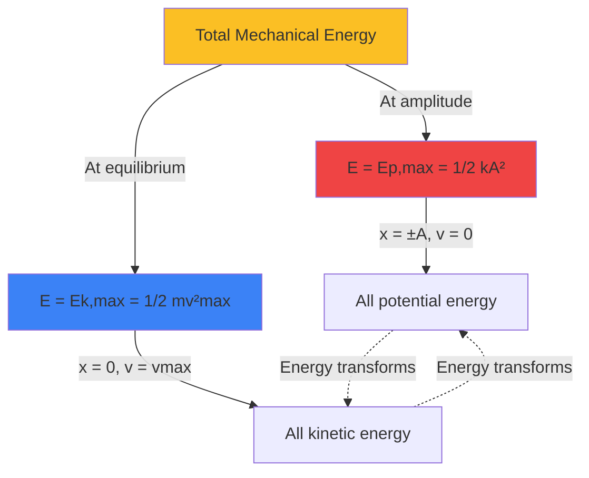

# Mechanical Oscillations Tasks

Create advanced physics problems that explore periodic motion, harmonic oscillators, and oscillation characteristics. Problems should help students describe oscillations using physical quantities, analyze harmonic motion mathematically using differential equations and trigonometric functions, understand energy transformations between kinetic and potential energy, and apply concepts to spring and pendulum systems.

**Vary the problem structure:**
- **Oscillation parameters**: Define and calculate amplitude $A$, period $T$, frequency $f = \frac{1}{T}$, angular frequency $\omega = 2\pi f = \frac{2\pi}{T}$
- **Spring pendulum analysis**: Use $T = 2\pi \sqrt{\frac{m}{k}}$ for period; analyze mass-spring systems with Hooke's law $F = -kx$
- **Mathematical pendulum**: Small angle approximation gives $T = 2\pi \sqrt{\frac{L}{g}}$ for period; independent of mass
- **Harmonic motion equations**: Position $x(t) = A \cos(\omega t + \phi)$, velocity $v(t) = -A\omega \sin(\omega t + \phi)$, acceleration $a(t) = -A\omega^2 \cos(\omega t + \phi) = -\omega^2 x$
- **Energy in oscillations**: Total energy $E = \frac{1}{2}kA^2$ remains constant; kinetic energy $E_k = \frac{1}{2}mv^2$ and potential energy $E_p = \frac{1}{2}kx^2$ transform continuously
- **Maximum values**: Maximum velocity $v_{max} = A\omega$ at equilibrium ($x = 0$); maximum acceleration $a_{max} = A\omega^2$ at amplitude ($x = \pm A$)
- **Phase analysis**: Determine phase constant $\phi$ from initial conditions; understand phase relationships between $x(t)$, $v(t)$, and $a(t)$
- **Damped oscillations**: Exponential amplitude decrease $A(t) = A_0 e^{-\gamma t}$; understand damping coefficient and quality factor
- **Forced oscillations and resonance**: Analyze driving force at frequency $f_d$; resonance occurs when $f_d \approx f_0$ (natural frequency)
- **Differential equations**: Set up and solve $m\ddot{x} + kx = 0$ for harmonic oscillator; understand SHM as solution $x(t) = A\cos(\omega t + \phi)$

**Vary the content/context:**
- **Spring systems**: Horizontal mass-spring on frictionless surface, vertical spring with gravity, series/parallel spring combinations, bungee jumping
- **Pendulums**: Simple pendulum, physical pendulum (extended body), Foucault pendulum, pendulum in accelerating reference frame
- **Real-world oscillators**: Clock pendulums, metronomes, swing sets, vibration isolation systems, suspension bridges
- **Engineering applications**: Shock absorbers, seismographs, vibration dampers in buildings, tuned mass dampers in skyscrapers
- **Musical applications**: Tuning forks, guitar strings, drumheads, piano strings, resonance in instruments
- **Atomic/molecular**: Qualitative connection to molecular vibrations, crystal lattice oscillations, quantum harmonic oscillator

**Vary the complexity based on age:**
- **For younger ages** ({{age}} < 17): Standard spring and pendulum period calculations, basic harmonic motion with given equations, energy transformations at specific positions, graphical analysis of $x(t)$, $v(t)$, $a(t)$
- **For middle ages** ({{age}} 17): Derive period formulas, complete energy analysis throughout oscillation cycle, phase calculations from initial conditions, velocity and acceleration from position equation, damping concepts
- **For older ages** ({{age}} >= 18): Differential equation solutions, complex phase analysis, coupled oscillators, non-linear oscillations (large angle pendulum), resonance curve analysis, quality factor calculations

**Use appropriate formats:**

**LaTeX for formulas:**
- Inline: Period $T = 2\pi\sqrt{\frac{m}{k}}$, frequency $f = \frac{1}{T}$, angular frequency $\omega = 2\pi f$
- Block for fundamental oscillation equations:

**Spring Pendulum:**
$$T = 2\pi\sqrt{\frac{m}{k}} \quad \text{where } k = \text{spring constant}, m = \text{mass}$$

**Mathematical Pendulum (small angles):**
$$T = 2\pi\sqrt{\frac{L}{g}} \quad \text{independent of mass}$$

**Harmonic motion:**
$$x(t) = A\cos(\omega t + \phi)$$
$$v(t) = \frac{dx}{dt} = -A\omega\sin(\omega t + \phi)$$
$$a(t) = \frac{dv}{dt} = -A\omega^2\cos(\omega t + \phi) = -\omega^2 x$$

**Energy in oscillations:**
$$E_{total} = E_k + E_p = \frac{1}{2}mv^2 + \frac{1}{2}kx^2 = \frac{1}{2}kA^2 = \text{constant}$$

**Maximum values:**
$$v_{max} = A\omega = A \cdot 2\pi f \quad \text{(at } x = 0\text{)}$$
$$a_{max} = A\omega^2 = A \cdot (2\pi f)^2 \quad \text{(at } x = \pm A\text{)}$$

**Damped oscillation:**
$$A(t) = A_0 e^{-\gamma t} \quad \text{where } \gamma = \text{damping coefficient}$$

**Differential equation of motion:**
$$m\ddot{x} + kx = 0 \quad \Rightarrow \quad \ddot{x} + \omega^2 x = 0$$

**Tables for oscillation data:**

| System Type | Period Formula | Natural Frequency | Energy Form |
|------------|---------------|-------------------|-------------|
| Spring pendulum | $T = 2\pi\sqrt{m/k}$ | $f_0 = \frac{1}{2\pi}\sqrt{k/m}$ | Elastic + Kinetic |
| Mathematical pendulum | $T = 2\pi\sqrt{L/g}$ | $f_0 = \frac{1}{2\pi}\sqrt{g/L}$ | Gravitational + Kinetic |
| Physical pendulum | $T = 2\pi\sqrt{I/(mgd)}$ | $f_0 = \frac{1}{2\pi}\sqrt{mgd/I}$ | Gravitational + Rotational |

| Phase | Position $x$ | Velocity $v$ | Acceleration $a$ | $E_k$ | $E_p$ |
|-------|--------------|--------------|------------------|-------|-------|
| $t = 0$ | $x = A$ | $v = 0$ | $a = -\omega^2 A$ | 0 | max |
| $t = T/4$ | $x = 0$ | $v = -A\omega$ | $a = 0$ | max | 0 |
| $t = T/2$ | $x = -A$ | $v = 0$ | $a = \omega^2 A$ | 0 | max |
| $t = 3T/4$ | $x = 0$ | $v = A\omega$ | $a = 0$ | max | 0 |

**Mermaid diagrams for oscillation concepts:**




**SVG diagrams for oscillation visualization:**

Use SVG to show:
- Mass-spring system in different positions with force arrows
- Energy bar charts showing $E_k$ and $E_p$ at different positions
- Position-time, velocity-time, and acceleration-time graphs
- Phase relationships between $x(t)$, $v(t)$, and $a(t)$
- Pendulum at different angles with velocity and force vectors
- Damped oscillation amplitude decay over time
- Resonance curves showing amplitude vs. driving frequency

Example SVG for spring pendulum energy:
```svg
<svg viewBox="0 0 600 400" xmlns="http://www.w3.org/2000/svg">
  <defs>
    <marker id="arrow" markerWidth="10" markerHeight="10" refX="9" refY="3" orient="auto" markerUnits="strokeWidth">
      <path d="M0,0 L0,6 L9,3 z" fill="black" />
    </marker>
  </defs>

  <!-- Position 1: Maximum displacement right -->
  <g>
    <text x="30" y="30" font-size="14" font-weight="bold">Position 1: x = +A</text>
    <!-- Spring -->
    <path d="M 50 60 L 65 60 L 70 55 L 75 65 L 80 55 L 85 65 L 90 55 L 95 65 L 100 60 L 140 60"
          fill="none" stroke="black" stroke-width="2"/>
    <!-- Mass -->
    <rect x="140" y="50" width="30" height="20" fill="#3b82f6" stroke="black" stroke-width="2"/>
    <!-- Energy bars -->
    <rect x="50" y="100" width="30" height="80" fill="#ef4444" opacity="0.7"/>
    <text x="45" y="95" font-size="12">Ep</text>
    <rect x="90" y="180" width="30" height="0" fill="#10b981" opacity="0.7"/>
    <text x="85" y="195" font-size="12">Ek=0</text>
  </g>

  <!-- Position 2: Equilibrium moving left -->
  <g>
    <text x="230" y="30" font-size="14" font-weight="bold">Position 2: x = 0</text>
    <!-- Spring at equilibrium -->
    <path d="M 250 60 L 265 60 L 270 55 L 275 65 L 280 55 L 285 65 L 290 55 L 295 65 L 300 60 L 320 60"
          fill="none" stroke="black" stroke-width="2"/>
    <!-- Mass -->
    <rect x="320" y="50" width="30" height="20" fill="#3b82f6" stroke="black" stroke-width="2"/>
    <!-- Velocity arrow -->
    <line x1="335" y1="40" x2="300" y2="40" stroke="red" stroke-width="3" marker-end="url(#arrow)"/>
    <text x="300" y="35" font-size="12" fill="red">vmax</text>
    <!-- Energy bars -->
    <rect x="250" y="180" width="30" height="0" fill="#ef4444" opacity="0.7"/>
    <text x="245" y="195" font-size="12">Ep=0</text>
    <rect x="290" y="100" width="30" height="80" fill="#10b981" opacity="0.7"/>
    <text x="285" y="95" font-size="12">Ek</text>
  </g>

  <!-- Position 3: Maximum displacement left -->
  <g>
    <text x="430" y="30" font-size="14" font-weight="bold">Position 3: x = -A</text>
    <!-- Spring compressed -->
    <path d="M 450 60 L 460 55 L 465 65 L 470 55 L 475 65 L 480 55 L 485 65 L 490 60 L 500 60"
          fill="none" stroke="black" stroke-width="3"/>
    <!-- Mass -->
    <rect x="500" y="50" width="30" height="20" fill="#3b82f6" stroke="black" stroke-width="2"/>
    <!-- Energy bars -->
    <rect x="450" y="100" width="30" height="80" fill="#ef4444" opacity="0.7"/>
    <text x="445" y="95" font-size="12">Ep</text>
    <rect x="490" y="180" width="30" height="0" fill="#10b981" opacity="0.7"/>
    <text x="485" y="195" font-size="12">Ek=0</text>
  </g>

  <!-- Legend -->
  <text x="200" y="250" font-size="16" font-weight="bold">Energy Conservation in Oscillation</text>
  <rect x="180" y="260" width="20" height="20" fill="#ef4444" opacity="0.7"/>
  <text x="205" y="275" font-size="14">Potential Energy (Ep)</text>
  <rect x="180" y="285" width="20" height="20" fill="#10b981" opacity="0.7"/>
  <text x="205" y="300" font-size="14">Kinetic Energy (Ek)</text>
  <text x="150" y="330" font-size="13">Total Energy: E = Ep + Ek = ½kA² = constant</text>
</svg>
```

Example SVG for harmonic motion graphs:
```svg
<svg viewBox="0 0 600 500" xmlns="http://www.w3.org/2000/svg">
  <!-- Position vs time -->
  <text x="20" y="30" font-size="14" font-weight="bold">Position: x(t) = A cos(ωt)</text>
  <line x1="50" y1="100" x2="550" y2="100" stroke="black" stroke-width="1"/>
  <line x1="50" y1="50" x2="50" y2="150" stroke="black" stroke-width="1" marker-end="url(#arrow)"/>
  <path d="M 50 100 Q 112.5 50, 175 100 T 300 100 T 425 100 T 550 100"
        fill="none" stroke="#3b82f6" stroke-width="3"/>
  <text x="20" y="55" font-size="12">+A</text>
  <text x="20" y="105" font-size="12">0</text>
  <text x="20" y="150" font-size="12">-A</text>
  <text x="555" y="105" font-size="12">t</text>

  <!-- Velocity vs time -->
  <text x="20" y="200" font-size="14" font-weight="bold">Velocity: v(t) = -Aω sin(ωt)</text>
  <line x1="50" y1="270" x2="550" y2="270" stroke="black" stroke-width="1"/>
  <line x1="50" y1="220" x2="50" y2="320" stroke="black" stroke-width="1" marker-end="url(#arrow)"/>
  <path d="M 50 270 Q 87.5 270, 112.5 220 Q 137.5 170, 175 170 Q 212.5 170, 237.5 220 Q 262.5 270, 300 270 Q 337.5 270, 362.5 320 Q 387.5 370, 425 370 Q 462.5 370, 487.5 320 Q 512.5 270, 550 270"
        fill="none" stroke="#10b981" stroke-width="3"/>
  <text x="555" y="275" font-size="12">t</text>

  <!-- Acceleration vs time -->
  <text x="20" y="370" font-size="14" font-weight="bold">Acceleration: a(t) = -ω²x(t)</text>
  <line x1="50" y1="440" x2="550" y2="440" stroke="black" stroke-width="1"/>
  <line x1="50" y1="390" x2="50" y2="490" stroke="black" stroke-width="1" marker-end="url(#arrow)"/>
  <path d="M 50 440 Q 112.5 490, 175 440 T 300 440 T 425 440 T 550 440"
        fill="none" stroke="#ef4444" stroke-width="3"/>
  <text x="555" y="445" font-size="12">t</text>

  <!-- Phase annotation -->
  <line x1="175" y1="50" x2="175" y2="490" stroke="gray" stroke-width="1" stroke-dasharray="5,5"/>
  <text x="160" y="510" font-size="12">T/4</text>
  <line x1="300" y1="50" x2="300" y2="490" stroke="gray" stroke-width="1" stroke-dasharray="5,5"/>
  <text x="285" y="510" font-size="12">T/2</text>
</svg>
```

**Adjust difficulty with {{difficulty}}:**
- **Easy**: Calculate period from given mass/spring constant or length/gravity, find frequency from period, determine amplitude from graph, basic energy at extreme positions
- **Medium**: Derive velocity and acceleration from position equation, complete energy analysis at any position, determine phase constant from initial conditions, calculate maximum velocity and acceleration
- **Hard**: Solve differential equations for SHM, analyze coupled oscillators, damped oscillation calculations, resonance analysis with quality factor, non-linear pendulum (large angles), phase space diagrams

**Include variety in numerical values:**
- Spring constants: k = 10 N/m, 50 N/m, 100 N/m, 200 N/m, 500 N/m
- Masses: m = 0.1 kg, 0.5 kg, 1 kg, 2 kg, 5 kg
- Amplitudes: A = 5 cm, 10 cm, 20 cm, 0.5 m
- Pendulum lengths: L = 0.5 m, 1 m, 2 m, 10 m, 100 m (Foucault)
- Periods: T = 0.5 s, 1 s, 2 s, 3.14 s (≈ π s), 10 s
- Frequencies: f = 0.1 Hz, 0.5 Hz, 1 Hz, 2 Hz, 5 Hz, 10 Hz
- Angular frequencies: ω = π rad/s, 2π rad/s, 10 rad/s
- Gravitational acceleration: g = 9.81 m/s² or 10 m/s² (simplified)
- Damping coefficients: γ = 0.1 s⁻¹, 0.5 s⁻¹, 1 s⁻¹
- Use realistic scenarios: grandfather clock (T ≈ 2 s, L ≈ 1 m), playground swing, car suspension (f ≈ 1 Hz)
- Ensure problems require deep understanding of harmonic motion mathematics and energy principles
