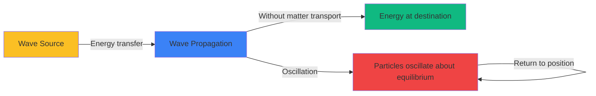

# Mechanical Waves Tasks

Create advanced physics problems that explore wave propagation, wave characteristics, and wave phenomena. Problems should help students distinguish between transverse and longitudinal waves, understand wave propagation and energy transport without matter transport, apply the superposition principle to analyze wave interference, and study diffraction and standing waves.

**Vary the problem structure:**
- **Wave equation fundamentals**: Apply $v = \lambda \cdot f$ to relate wave speed, wavelength, and frequency; understand $v = \frac{\lambda}{T}$
- **Transverse vs. longitudinal**: Distinguish wave types - transverse (oscillation perpendicular to propagation: water, string), longitudinal (oscillation parallel: sound, spring compression)
- **Wave description**: Use $y(x,t) = A\sin(kx - \omega t + \phi)$ where $k = \frac{2\pi}{\lambda}$ (wave number), $\omega = 2\pi f$ (angular frequency)
- **Phase velocity and group velocity**: Analyze wave packet propagation; understand phase velocity $v_p = \frac{\omega}{k}$
- **Energy transport**: Understand waves transport energy without net matter transport; energy proportional to $A^2$ and $f^2$
- **Superposition principle**: Sum of waves $y_{total} = y_1 + y_2$ when waves overlap; basis for interference and standing waves
- **Interference**: Constructive (path difference $\Delta s = n\lambda$, $n = 0, 1, 2, ...$) and destructive ($\Delta s = (n + \frac{1}{2})\lambda$)
- **Standing waves**: Form when waves reflect and interfere; nodes (no motion) at $x = n\frac{\lambda}{2}$, antinodes (maximum motion) at $x = (n + \frac{1}{2})\frac{\lambda}{2}$
- **Standing waves on strings**: Resonance frequencies $f_n = n\frac{v}{2L}$ where $L =$ string length, $n = 1, 2, 3, ...$ (harmonics)
- **Diffraction**: Wave bending around obstacles/through openings; significant when opening size comparable to wavelength
- **Huygens' principle**: Each point on wavefront acts as source of secondary wavelets; explains reflection, refraction, diffraction
- **Wave intensity**: $I \propto A^2$; for spherical waves, $I \propto \frac{1}{r^2}$ (inverse square law)

**Vary the content/context:**
- **Water waves**: Ocean waves, ripples in pond, wave tanks, tsunami propagation, shallow vs. deep water waves
- **Waves on strings**: Guitar strings, piano strings, violin, standing waves and harmonics, wave reflection at fixed/free ends
- **Sound waves**: Longitudinal pressure waves, sound interference, beats, acoustics, noise cancellation
- **Seismic waves**: Earthquakes generate P-waves (longitudinal) and S-waves (transverse), wave speed in Earth's layers
- **Wave energy**: Ocean wave power generation, wave energy density, amplitude and frequency dependence
- **Slinky waves**: Visual demonstration of transverse and longitudinal waves in classroom
- **Two-source interference**: Ripple tank with two sources, speaker interference patterns, path difference analysis

**Vary the complexity based on age:**
- **For younger ages** ({{age}} < 17): Wave equation calculations ($v = \lambda f$), identify transverse vs. longitudinal, qualitative superposition, basic interference conditions, standing wave patterns on strings
- **For middle ages** ({{age}} 17): Mathematical wave functions, quantitative interference analysis with path differences, standing wave frequency calculations, energy transport concepts, diffraction phenomena
- **For older ages** ({{age}} >= 18): Complex wave function analysis, derive interference conditions, wave packets and dispersion, advanced standing wave systems, Huygens' construction for diffraction, coupled wave equations

**Use appropriate formats:**

**LaTeX for formulas:**
- Inline: Wave equation $v = \lambda \cdot f$, wave number $k = \frac{2\pi}{\lambda}$, angular frequency $\omega = 2\pi f$
- Block for fundamental wave relationships:

**Wave equation:**
$$v = \lambda \cdot f = \frac{\lambda}{T}$$

**Wave function:**
$$y(x,t) = A\sin(kx - \omega t + \phi)$$

where:
- $A$ = amplitude
- $k = \frac{2\pi}{\lambda}$ = wave number
- $\omega = 2\pi f$ = angular frequency
- $\phi$ = phase constant

**Wave speed on string:**
$$v = \sqrt{\frac{F_T}{\mu}} \quad \text{where } F_T = \text{tension}, \mu = \text{linear mass density}$$

**Superposition:**
$$y_{total}(x,t) = y_1(x,t) + y_2(x,t)$$

**Interference conditions:**

Constructive: $\Delta s = n\lambda \quad (n = 0, 1, 2, 3, ...)$

Destructive: $\Delta s = \left(n + \frac{1}{2}\right)\lambda \quad (n = 0, 1, 2, 3, ...)$

**Standing waves on string (both ends fixed):**
$$\lambda_n = \frac{2L}{n} \quad \Rightarrow \quad f_n = n\frac{v}{2L} = nf_1 \quad (n = 1, 2, 3, ...)$$

where:
- $f_1 = \frac{v}{2L}$ = fundamental frequency
- $n$ = harmonic number

**Wave intensity:**
$$I \propto A^2 \quad \text{and for spherical waves} \quad I = \frac{P}{4\pi r^2}$$

**Tables for wave data:**

| Wave Type | Oscillation Direction | Medium Required | Examples |
|-----------|----------------------|-----------------|-----------|
| Transverse | ⊥ to propagation | Usually solid or surface | String, water surface, S-waves |
| Longitudinal | ∥ to propagation | Solid, liquid, gas | Sound, P-waves, slinky compression |

| Medium | Wave Type | Speed (m/s) |
|--------|-----------|-------------|
| Air (sound) | Longitudinal | 340 |
| Water (sound) | Longitudinal | 1500 |
| Steel (sound) | Longitudinal | 5000 |
| Water surface | Transverse | ~1-15 (depends on depth) |
| String | Transverse | Depends on tension and density |

| Harmonic | Wavelength | Frequency | Pattern |
|----------|------------|-----------|---------|
| n = 1 (fundamental) | λ₁ = 2L | f₁ = v/(2L) | One antinode |
| n = 2 (first overtone) | λ₂ = L | f₂ = 2f₁ | Two antinodes |
| n = 3 (second overtone) | λ₃ = 2L/3 | f₃ = 3f₁ | Three antinodes |

**Mermaid diagrams for wave concepts:**



```mermaid
graph TD
    A[Two Waves Meet] -->|Superposition| B[Add Displacements]
    B -->|Same phase| C[Constructive Interference]
    B -->|Opposite phase| D[Destructive Interference]
    C -->|Amplitude| E[A_total = A₁ + A₂]
    D -->|Amplitude| F[A_total = |A₁ - A₂|]
    C -->|Path difference| G[Δs = nλ]
    D -->|Path difference| H[Δs = n+1/2 λ]

    style A fill:#fbbf24
    style C fill:#10b981
    style D fill:#ef4444
```

**SVG diagrams for wave visualization:**

Use SVG to show:
- Transverse wave: particle motion perpendicular to wave direction
- Longitudinal wave: compressions and rarefactions
- Wave parameters: amplitude, wavelength, period on sinusoidal wave
- Superposition of two waves creating interference pattern
- Standing wave with nodes and antinodes marked
- Two-source interference pattern (concentric circles)
- Diffraction through single slit showing wave bending
- Wave reflection and transmission at boundary

Example SVG for transverse vs. longitudinal waves:
```svg
<svg viewBox="0 0 600 400" xmlns="http://www.w3.org/2000/svg">
  <defs>
    <marker id="arrow" markerWidth="10" markerHeight="10" refX="9" refY="3" orient="auto" markerUnits="strokeWidth">
      <path d="M0,0 L0,6 L9,3 z" fill="black" />
    </marker>
  </defs>

  <!-- Transverse Wave -->
  <text x="50" y="30" font-size="16" font-weight="bold">Transverse Wave</text>

  <!-- Wave propagation direction -->
  <line x1="50" y1="100" x2="500" y2="100" stroke="gray" stroke-width="1" stroke-dasharray="5,5"/>
  <line x1="450" y1="100" x2="500" y2="100" stroke="red" stroke-width="3" marker-end="url(#arrow)"/>
  <text x="460" y="90" font-size="14" fill="red">v</text>

  <!-- Sinusoidal wave -->
  <path d="M 50 100 Q 90 50, 130 100 T 210 100 T 290 100 T 370 100 T 450 100"
        fill="none" stroke="#3b82f6" stroke-width="3"/>

  <!-- Particle oscillation (vertical) -->
  <circle cx="210" cy="100" r="5" fill="#fbbf24"/>
  <line x1="210" y1="100" x2="210" y2="50" stroke="#10b981" stroke-width="2" marker-end="url(#arrow)"/>
  <line x1="210" y1="100" x2="210" y2="150" stroke="#10b981" stroke-width="2" marker-end="url(#arrow)"/>
  <text x="220" y="80" font-size="12" fill="#10b981">Particle motion ⊥</text>

  <!-- Wavelength -->
  <line x1="130" y1="120" x2="290" y2="120" stroke="black" stroke-width="1"/>
  <line x1="130" y1="115" x2="130" y2="125" stroke="black" stroke-width="2"/>
  <line x1="290" y1="115" x2="290" y2="125" stroke="black" stroke-width="2"/>
  <text x="195" y="140" font-size="14">λ</text>

  <!-- Longitudinal Wave -->
  <text x="50" y="230" font-size="16" font-weight="bold">Longitudinal Wave</text>

  <!-- Wave propagation direction -->
  <line x1="50" y1="300" x2="500" y2="300" stroke="gray" stroke-width="1" stroke-dasharray="5,5"/>
  <line x1="450" y1="300" x2="500" y2="300" stroke="red" stroke-width="3" marker-end="url(#arrow)"/>
  <text x="460" y="290" font-size="14" fill="red">v</text>

  <!-- Compression and rarefaction zones -->
  <!-- High density (compression) -->
  <circle cx="100" cy="300" r="3" fill="#3b82f6" opacity="0.8"/>
  <circle cx="110" cy="305" r="3" fill="#3b82f6" opacity="0.8"/>
  <circle cx="120" cy="295" r="3" fill="#3b82f6" opacity="0.8"/>
  <circle cx="130" cy="300" r="3" fill="#3b82f6" opacity="0.8"/>
  <circle cx="140" cy="305" r="3" fill="#3b82f6" opacity="0.8"/>
  <text x="100" y="330" font-size="12">C</text>

  <!-- Low density (rarefaction) -->
  <circle cx="180" cy="300" r="3" fill="#3b82f6" opacity="0.3"/>
  <circle cx="200" cy="305" r="3" fill="#3b82f6" opacity="0.3"/>
  <circle cx="220" cy="295" r="3" fill="#3b82f6" opacity="0.3"/>
  <text x="195" y="330" font-size="12">R</text>

  <!-- High density -->
  <circle cx="260" cy="300" r="3" fill="#3b82f6" opacity="0.8"/>
  <circle cx="270" cy="305" r="3" fill="#3b82f6" opacity="0.8"/>
  <circle cx="280" cy="295" r="3" fill="#3b82f6" opacity="0.8"/>
  <circle cx="290" cy="300" r="3" fill="#3b82f6" opacity="0.8"/>
  <circle cx="300" cy="305" r="3" fill="#3b82f6" opacity="0.8"/>
  <text x="270" y="330" font-size="12">C</text>

  <!-- Particle oscillation (horizontal) -->
  <circle cx="210" cy="300" r="5" fill="#fbbf24"/>
  <line x1="210" y1="300" x2="170" y2="300" stroke="#10b981" stroke-width="2" marker-end="url(#arrow)"/>
  <line x1="210" y1="300" x2="250" y2="300" stroke="#10b981" stroke-width="2" marker-end="url(#arrow)"/>
  <text x="220" y="320" font-size="12" fill="#10b981">Particle motion ∥</text>

  <!-- Legend -->
  <text x="50" y="370" font-size="13">C = Compression (high density)</text>
  <text x="50" y="390" font-size="13">R = Rarefaction (low density)</text>
</svg>
```

Example SVG for standing wave:
```svg
<svg viewBox="0 0 600 350" xmlns="http://www.w3.org/2000/svg">
  <!-- Title -->
  <text x="150" y="30" font-size="16" font-weight="bold">Standing Wave (n = 3, Third Harmonic)</text>

  <!-- Fixed ends -->
  <line x1="50" y1="150" x2="50" y2="250" stroke="black" stroke-width="8"/>
  <line x1="550" y1="150" x2="550" y2="250" stroke="black" stroke-width="8"/>

  <!-- String at maximum displacement (solid line) -->
  <path d="M 50 200 Q 125 150, 200 200 T 350 200 Q 425 250, 500 200 L 550 200"
        fill="none" stroke="#3b82f6" stroke-width="3"/>

  <!-- String at opposite maximum (dashed line) -->
  <path d="M 50 200 Q 125 250, 200 200 T 350 200 Q 425 150, 500 200 L 550 200"
        fill="none" stroke="#3b82f6" stroke-width="2" stroke-dasharray="5,5" opacity="0.5"/>

  <!-- Equilibrium position -->
  <line x1="50" y1="200" x2="550" y2="200" stroke="gray" stroke-width="1" stroke-dasharray="3,3"/>

  <!-- Nodes (N) -->
  <circle cx="50" cy="200" r="6" fill="#ef4444"/>
  <text x="40" y="225" font-size="14" font-weight="bold" fill="#ef4444">N</text>

  <circle cx="200" cy="200" r="6" fill="#ef4444"/>
  <text x="190" y="225" font-size="14" font-weight="bold" fill="#ef4444">N</text>

  <circle cx="350" cy="200" r="6" fill="#ef4444"/>
  <text x="340" y="225" font-size="14" font-weight="bold" fill="#ef4444">N</text>

  <circle cx="500" cy="200" r="6" fill="#ef4444"/>
  <text x="490" y="225" font-size="14" font-weight="bold" fill="#ef4444">N</text>

  <circle cx="550" cy="200" r="6" fill="#ef4444"/>
  <text x="540" y="225" font-size="14" font-weight="bold" fill="#ef4444">N</text>

  <!-- Antinodes (A) -->
  <circle cx="125" cy="150" r="6" fill="#10b981"/>
  <text x="115" y="140" font-size="14" font-weight="bold" fill="#10b981">A</text>

  <circle cx="275" cy="200" r="6" fill="#10b981"/>
  <text x="265" y="190" font-size="14" font-weight="bold" fill="#10b981">A</text>

  <circle cx="425" cy="250" r="6" fill="#10b981"/>
  <text x="415" y="270" font-size="14" font-weight="bold" fill="#10b981">A</text>

  <!-- Wavelength markers -->
  <line x1="50" y1="280" x2="383" y2="280" stroke="black" stroke-width="2"/>
  <line x1="50" y1="275" x2="50" y2="285" stroke="black" stroke-width="2"/>
  <line x1="383" y1="275" x2="383" y2="285" stroke="black" stroke-width="2"/>
  <text x="200" y="300" font-size="14">λ = 2L/3</text>

  <!-- String length -->
  <line x1="50" y1="320" x2="550" y2="320" stroke="purple" stroke-width="2"/>
  <line x1="50" y1="315" x2="50" y2="325" stroke="purple" stroke-width="2"/>
  <line x1="550" y1="315" x2="550" y2="325" stroke="purple" stroke-width="2"/>
  <text x="280" y="340" font-size="14" fill="purple">L (string length)</text>
</svg>
```

Example SVG for interference:
```svg
<svg viewBox="0 0 600 350" xmlns="http://www.w3.org/2000/svg">
  <!-- Constructive Interference -->
  <text x="50" y="30" font-size="16" font-weight="bold">Constructive Interference</text>

  <!-- Wave 1 -->
  <path d="M 50 80 Q 90 50, 130 80 T 210 80 T 290 80"
        fill="none" stroke="#3b82f6" stroke-width="2"/>
  <text x="300" y="85" font-size="12" fill="#3b82f6">Wave 1 (A₁)</text>

  <!-- Wave 2 (same phase) -->
  <path d="M 50 130 Q 90 100, 130 130 T 210 130 T 290 130"
        fill="none" stroke="#10b981" stroke-width="2"/>
  <text x="300" y="135" font-size="12" fill="#10b981">Wave 2 (A₂)</text>

  <!-- Superposition -->
  <path d="M 50 180 Q 90 120, 130 180 T 210 180 T 290 180"
        fill="none" stroke="#ef4444" stroke-width="3"/>
  <text x="300" y="185" font-size="12" fill="#ef4444">A_total = A₁ + A₂</text>
  <text x="50" y="215" font-size="13">Phase difference: Δφ = 0, 2π, 4π, ...</text>
  <text x="50" y="230" font-size="13">Path difference: Δs = 0, λ, 2λ, ...</text>

  <!-- Destructive Interference -->
  <text x="50" y="280" font-size="16" font-weight="bold">Destructive Interference</text>

  <!-- Wave 1 -->
  <path d="M 350 330 Q 390 300, 430 330 T 510 330"
        fill="none" stroke="#3b82f6" stroke-width="2"/>
  <text x="520" y="335" font-size="12" fill="#3b82f6">Wave 1 (A₁)</text>

  <!-- Wave 2 (opposite phase) -->
  <path d="M 350 380 Q 390 410, 430 380 T 510 380"
        fill="none" stroke="#10b981" stroke-width="2"/>
  <text x="520" y="385" font-size="12" fill="#10b981">Wave 2 (A₂)</text>

  <!-- Superposition (cancelled if equal amplitudes) -->
  <line x1="350" y1="430" x2="530" y2="430" stroke="#ef4444" stroke-width="3"/>
  <text x="540" y="435" font-size="12" fill="#ef4444">A_total = 0</text>
  <text x="350" y="465" font-size="13">Phase difference: Δφ = π, 3π, 5π, ...</text>
  <text x="350" y="480" font-size="13">Path difference: Δs = λ/2, 3λ/2, 5λ/2, ...</text>
</svg>
```

**Adjust difficulty with {{difficulty}}:**
- **Easy**: Wave equation calculations ($v = \lambda f$), identify transverse vs. longitudinal from descriptions, basic standing wave patterns, qualitative interference (constructive/destructive)
- **Medium**: Calculate standing wave frequencies on strings, path difference for interference, energy transport analysis, wave function evaluation at specific points and times, diffraction qualitative
- **Hard**: Derive wave equations, complex superposition of multiple waves, beat frequency analysis ($f_{beat} = |f_1 - f_2|$), wave packets and dispersion, quantitative diffraction, Doppler effect for mechanical waves

**Include variety in numerical values:**
- Wave speeds: v = 1 m/s, 2 m/s, 10 m/s, 340 m/s (sound), 1500 m/s (sound in water)
- Wavelengths: λ = 0.5 m, 1 m, 2 m, 5 m, 10 m, 0.01 m (1 cm)
- Frequencies: f = 0.5 Hz, 1 Hz, 2 Hz, 5 Hz, 100 Hz, 440 Hz, 1000 Hz
- Amplitudes: A = 2 cm, 5 cm, 10 cm, 0.5 m, 1 m
- String lengths: L = 0.5 m, 1 m, 2 m, 0.65 m (guitar string)
- String tensions: F_T = 50 N, 100 N, 200 N, 500 N
- Linear mass density: μ = 0.001 kg/m, 0.01 kg/m, 0.1 kg/m
- Periods: T = 0.5 s, 1 s, 2 s, 0.1 s
- Path differences: Δs = 0, λ/2, λ, 3λ/2, 2λ
- Use realistic scenarios: guitar string (L ≈ 0.65 m, fundamental ≈ 82-330 Hz), water waves (λ ~ meters, f ~ 1 Hz), sound (see sound-acoustics for values)
- Standing wave harmonics: n = 1, 2, 3, 4 with corresponding wavelengths and frequencies
- Ensure problems require deep understanding of wave mathematics, superposition, and interference
