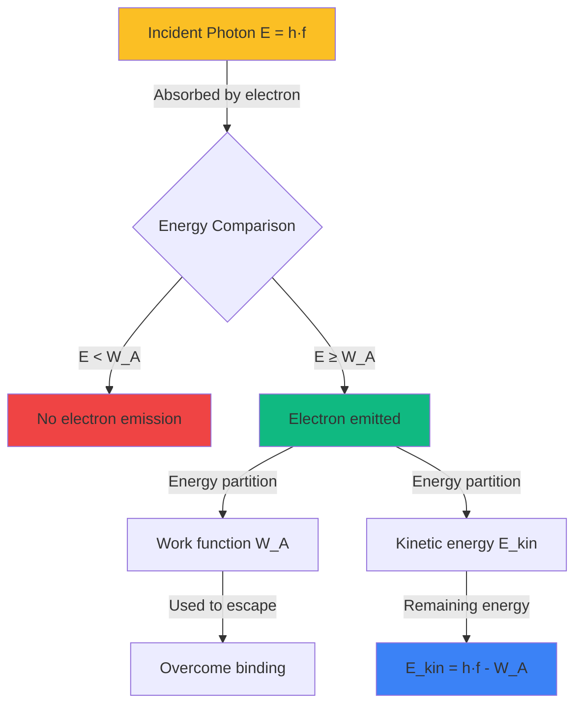
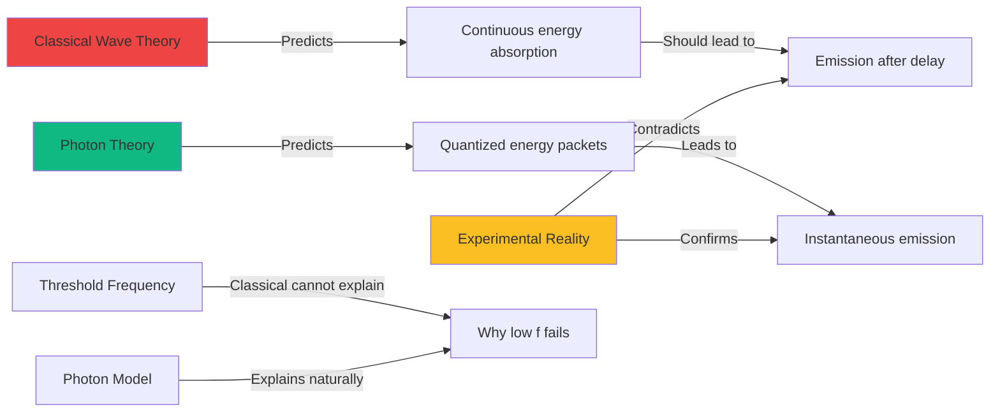

# Photons and Light Quanta Tasks

Create advanced physics problems that explore the quantum nature of light through the photoelectric effect and photon properties. Problems should help students understand the failure of classical wave theory, apply Einstein's photon model, and recognize wave-particle duality as a fundamental property of light.

**Vary the problem structure:**
- **Photon energy calculations**: Apply $E = h \cdot f = \frac{h \cdot c}{\lambda}$ where $h$ is Planck's constant, $f$ is frequency, $c$ is speed of light, $\lambda$ is wavelength
- **Photoelectric effect analysis**: Use Einstein's equation $E_{kin,max} = h \cdot f - W_A$ where $E_{kin,max}$ is maximum kinetic energy of photoelectrons, $W_A$ is work function
- **Threshold frequency**: Calculate $f_0 = \frac{W_A}{h}$ - minimum frequency for photoelectric emission, below which no electrons are emitted regardless of intensity
- **Stopping potential**: Use $U_0 = \frac{E_{kin,max}}{e}$ where $U_0$ is stopping voltage, $e$ is elementary charge
- **Work function determination**: From threshold wavelength $\lambda_0 = \frac{h \cdot c}{W_A}$ or from photoelectric data
- **Photon momentum**: Apply $p = \frac{h}{\lambda} = \frac{E}{c}$ for radiation pressure and Compton effect
- **Compton scattering**: Wavelength shift $\Delta\lambda = \frac{h}{m_e c}(1 - \cos\theta)$ where $m_e$ is electron mass, $\theta$ is scattering angle
- **Intensity vs. photon flux**: Relate classical intensity to number of photons per unit time and area $N = \frac{P}{E_{photon}}$
- **Historical experiments**: Analyze Hertz's discovery, Lenard's observations, Einstein's 1905 explanation, Millikan's verification
- **Wave-particle duality**: Discuss complementarity principle, when wave model vs. particle model is appropriate

**Vary the content/context:**
- **Photoelectric effect experiments**: Metal surfaces (sodium, potassium, zinc, cesium), photocathodes, vacuum phototubes
- **Technological applications**: Solar cells (photovoltaic effect), photodetectors, light meters, automatic door sensors, image sensors (CCD, CMOS)
- **Work function values**: Different metals have different work functions (Na: 2.3 eV, K: 2.0 eV, Zn: 4.3 eV, Cu: 4.7 eV, Pt: 5.6 eV)
- **Light sources**: UV lamps, visible light (different colors), X-rays, lasers with specific wavelengths
- **Particle nature demonstrations**: Radiation pressure, photon momentum transfer, light sails, optical tweezers
- **X-ray generation**: Inverse photoelectric effect - electrons hitting target produce X-ray photons with maximum energy $E_{max} = e \cdot U$
- **Quantum cryptography**: Single-photon sources, quantum key distribution using photon properties
- **LED and laser operation**: Photon emission through energy level transitions in semiconductors

**Vary the complexity based on age:**
- **For younger ages** ({{age}} < 18): Basic photon energy calculations, understand photoelectric effect qualitatively, simple threshold frequency problems, recognize particle nature
- **For middle ages** ({{age}} 18): Quantitative photoelectric effect analysis, work function calculations, stopping potential problems, photon momentum concepts
- **For older ages** ({{age}} >= 19): Compton scattering calculations, advanced wave-particle duality discussions, statistical interpretations, photon flux and intensity relationships, quantum measurement implications

**Use appropriate formats:**

**LaTeX for formulas:**
- Inline for relationships: Photon energy $E = h \cdot f = \frac{h \cdot c}{\lambda}$, work function $W_A$, threshold frequency $f_0$
- Block for fundamental equations:

**Photon energy:**
$$E_{photon} = h \cdot f = \frac{h \cdot c}{\lambda}$$

where:
- $h = 6.626 \times 10^{-34}$ J·s = 4.136 × 10⁻¹⁵ eV·s (Planck's constant)
- $f$ = frequency (Hz)
- $c = 3.00 \times 10^8$ m/s (speed of light)
- $\lambda$ = wavelength (m)

**Einstein's photoelectric equation:**
$$E_{kin,max} = h \cdot f - W_A = h \cdot (f - f_0)$$

where:
- $E_{kin,max}$ = maximum kinetic energy of photoelectrons
- $W_A$ = work function (minimum energy to remove electron)
- $f_0 = \frac{W_A}{h}$ = threshold frequency

**Threshold conditions:**
$$f_{threshold} = f_0 = \frac{W_A}{h}$$

$$\lambda_{threshold} = \lambda_0 = \frac{h \cdot c}{W_A} = \frac{c}{f_0}$$

**Stopping potential:**
$$U_0 = \frac{E_{kin,max}}{e} = \frac{h \cdot f - W_A}{e}$$

where $e = 1.602 \times 10^{-19}$ C (elementary charge)

**Photon momentum:**
$$p_{photon} = \frac{h}{\lambda} = \frac{E}{c} = \frac{h \cdot f}{c}$$

**Compton scattering (wavelength shift):**
$$\Delta\lambda = \lambda' - \lambda = \frac{h}{m_e c}(1 - \cos\theta)$$

where:
- $m_e = 9.109 \times 10^{-31}$ kg (electron mass)
- $\theta$ = scattering angle
- $\frac{h}{m_e c} = 2.43 \times 10^{-12}$ m (Compton wavelength)

**Photon flux (number of photons per second):**
$$N = \frac{P}{E_{photon}} = \frac{P \cdot \lambda}{h \cdot c}$$

where $P$ = power (W)

**Tables for typical values:**

| Metal | Work Function $W_A$ (eV) | Threshold Frequency $f_0$ (10¹⁴ Hz) | Threshold Wavelength $\lambda_0$ (nm) |
|-------|-------------------------|-------------------------------------|--------------------------------------|
| Sodium (Na) | 2.3 | 5.6 | 540 |
| Potassium (K) | 2.0 | 4.8 | 620 |
| Zinc (Zn) | 4.3 | 10.4 | 290 |
| Copper (Cu) | 4.7 | 11.4 | 265 |
| Platinum (Pt) | 5.6 | 13.5 | 222 |
| Cesium (Cs) | 1.9 | 4.6 | 650 |

| Light Color | Wavelength $\lambda$ (nm) | Frequency $f$ (10¹⁴ Hz) | Photon Energy $E$ (eV) |
|-------------|--------------------------|------------------------|----------------------|
| Red | 650 | 4.6 | 1.9 |
| Orange | 600 | 5.0 | 2.1 |
| Yellow | 580 | 5.2 | 2.1 |
| Green | 550 | 5.5 | 2.3 |
| Blue | 450 | 6.7 | 2.8 |
| Violet | 400 | 7.5 | 3.1 |
| UV (near) | 300 | 10.0 | 4.1 |
| UV (far) | 200 | 15.0 | 6.2 |

**Conversion factors:**
- 1 eV = 1.602 × 10⁻¹⁹ J
- To convert J to eV: divide by 1.602 × 10⁻¹⁹
- To convert eV to J: multiply by 1.602 × 10⁻¹⁹

**Mermaid diagrams for photoelectric effect:**





**SVG diagrams for photoelectric visualization:**

Use SVG to show:
- Photoelectric effect setup: light source, metal cathode, anode, ammeter, and stopping potential circuit
- Energy diagram: photon energy, work function, and kinetic energy relationships
- Classical wave prediction vs. quantum photon prediction comparison
- Photon absorption and electron emission process at atomic level
- Graph of $E_{kin,max}$ vs. frequency $f$ showing linear relationship with slope $h$ and x-intercept at $f_0$
- Threshold frequency concept: below $f_0$ no emission, above $f_0$ immediate emission
- Intensity effects: more photons lead to more electrons, but not higher kinetic energy

Example SVG for photoelectric effect apparatus:
```svg
<svg viewBox="0 0 600 400" xmlns="http://www.w3.org/2000/svg">
  <!-- Light source -->
  <circle cx="50" cy="200" r="20" fill="#fbbf24" stroke="black" stroke-width="2"/>
  <text x="30" y="245" font-size="12">Light</text>
  <text x="25" y="260" font-size="12">source</text>

  <!-- Photons (wavy arrows) -->
  <line x1="80" y1="200" x2="200" y2="200" stroke="#fbbf24" stroke-width="2" marker-end="url(#arrowhead)"/>
  <text x="120" y="190" font-size="11" fill="#fbbf24">hf</text>

  <!-- Vacuum tube -->
  <ellipse cx="350" cy="200" rx="130" ry="100" fill="none" stroke="black" stroke-width="3"/>

  <!-- Cathode (photoemissive surface) -->
  <rect x="220" y="150" width="20" height="100" fill="#9ca3af" stroke="black" stroke-width="2"/>
  <text x="200" y="130" font-size="12">Cathode</text>
  <text x="210" y="145" font-size="11">(metal)</text>

  <!-- Anode -->
  <rect x="460" y="160" width="15" height="80" fill="#6b7280" stroke="black" stroke-width="2"/>
  <text x="480" y="205" font-size="12">Anode</text>

  <!-- Photoelectron -->
  <circle cx="300" cy="190" r="4" fill="#ef4444"/>
  <line x1="240" y1="195" x2="295" y2="190" stroke="#ef4444" stroke-width="2" marker-end="url(#arrowhead-red)"/>
  <text x="260" y="185" font-size="10" fill="#ef4444">e⁻</text>

  <!-- Circuit -->
  <line x1="475" y1="240" x2="475" y2="320" stroke="black" stroke-width="2"/>
  <line x1="475" y1="320" x2="230" y2="320" stroke="black" stroke-width="2"/>
  <line x1="230" y1="320" x2="230" y2="250" stroke="black" stroke-width="2"/>

  <!-- Ammeter -->
  <circle cx="350" cy="320" r="20" fill="white" stroke="black" stroke-width="2"/>
  <text x="342" y="327" font-size="14" font-weight="bold">A</text>

  <!-- Voltage source (battery) -->
  <line x1="150" y1="310" x2="150" y2="330" stroke="black" stroke-width="3"/>
  <line x1="150" y1="305" x2="150" y2="315" stroke="black" stroke-width="1"/>
  <text x="125" y="325" font-size="12">U₀</text>

  <!-- Annotations -->
  <text x="50" y="370" font-size="13">Photon hits metal → Electron emitted → Current detected</text>

  <defs>
    <marker id="arrowhead" markerWidth="10" markerHeight="10" refX="9" refY="3" orient="auto">
      <polygon points="0 0, 10 3, 0 6" fill="#fbbf24" />
    </marker>
    <marker id="arrowhead-red" markerWidth="10" markerHeight="10" refX="9" refY="3" orient="auto">
      <polygon points="0 0, 10 3, 0 6" fill="#ef4444" />
    </marker>
  </defs>
</svg>
```

Example SVG for energy diagram:
```svg
<svg viewBox="0 0 500 350" xmlns="http://www.w3.org/2000/svg">
  <!-- Title -->
  <text x="100" y="30" font-size="16" font-weight="bold">Photoelectric Effect Energy Balance</text>

  <!-- Energy levels -->
  <line x1="50" y1="280" x2="450" y2="280" stroke="black" stroke-width="3"/>
  <text x="10" y="285" font-size="13">E = 0</text>

  <!-- Bound electron level -->
  <line x1="50" y1="200" x2="200" y2="200" stroke="#3b82f6" stroke-width="2" stroke-dasharray="5,5"/>
  <text x="50" y="190" font-size="12" fill="#3b82f6">Electron in metal</text>

  <!-- Work function arrow -->
  <line x1="100" y1="200" x2="100" y2="280" stroke="#ef4444" stroke-width="3" marker-end="url(#arrow-down)"/>
  <text x="110" y="240" font-size="14" fill="#ef4444" font-weight="bold">W_A</text>
  <text x="60" y="260" font-size="11" fill="#ef4444">(Work function)</text>

  <!-- Incident photon -->
  <line x1="250" y1="100" x2="250" y2="200" stroke="#fbbf24" stroke-width="4" marker-end="url(#arrow-down-yellow)"/>
  <text x="260" y="150" font-size="14" fill="#fbbf24" font-weight="bold">E_photon = hf</text>

  <!-- Emitted electron with kinetic energy -->
  <line x1="350" y1="280" x2="350" y2="150" stroke="#10b981" stroke-width="4" marker-end="url(#arrow-up)"/>
  <text x="360" y="210" font-size="14" fill="#10b981" font-weight="bold">E_kin,max</text>

  <!-- Energy equation -->
  <text x="80" y="330" font-size="15" font-weight="bold">hf = W_A + E_kin,max</text>

  <defs>
    <marker id="arrow-down" markerWidth="10" markerHeight="10" refX="5" refY="8" orient="auto">
      <polygon points="0 0, 10 0, 5 10" fill="#ef4444" />
    </marker>
    <marker id="arrow-down-yellow" markerWidth="10" markerHeight="10" refX="5" refY="8" orient="auto">
      <polygon points="0 0, 10 0, 5 10" fill="#fbbf24" />
    </marker>
    <marker id="arrow-up" markerWidth="10" markerHeight="10" refX="5" refY="2" orient="auto">
      <polygon points="0 10, 10 10, 5 0" fill="#10b981" />
    </marker>
  </defs>
</svg>
```

**Adjust difficulty with {{difficulty}}:**
- **Easy**: Calculate photon energy from wavelength/frequency using given formula, understand photoelectric effect qualitatively, identify threshold frequency concept
- **Medium**: Solve for work function from photoelectric data, calculate maximum kinetic energy of photoelectrons, determine stopping potential, wavelength-to-energy conversions
- **Hard**: Compton scattering calculations, derive relationships, analyze experimental data to extract Planck's constant, discuss wave-particle duality quantitatively, photon momentum applications

**Include variety in numerical values:**
- Wavelengths: 200 nm (UV), 300 nm, 400 nm (violet), 500 nm (green), 600 nm (red), 650 nm
- Frequencies: 4.5 × 10¹⁴ Hz, 5.5 × 10¹⁴ Hz, 7.5 × 10¹⁴ Hz, 10.0 × 10¹⁴ Hz
- Work functions: 1.9 eV (Cs), 2.0 eV (K), 2.3 eV (Na), 4.3 eV (Zn), 4.7 eV (Cu), 5.6 eV (Pt)
- Light power: 1 mW, 10 mW, 100 mW, 1 W for photon flux calculations
- Stopping potentials: 0.5 V, 1.0 V, 1.5 V, 2.0 V, 3.0 V
- Ensure calculations require understanding of energy unit conversions (J ↔ eV)
- Use realistic experimental scenarios with appropriate numerical scales
- Vary metals and light sources to prevent pattern recognition
