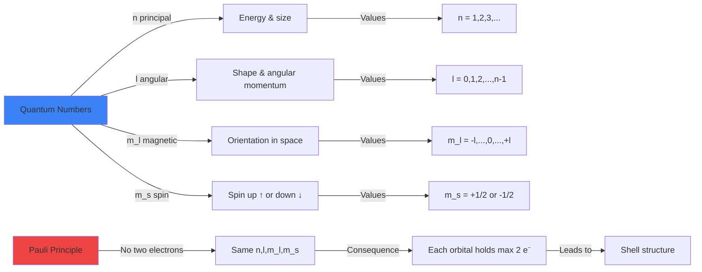
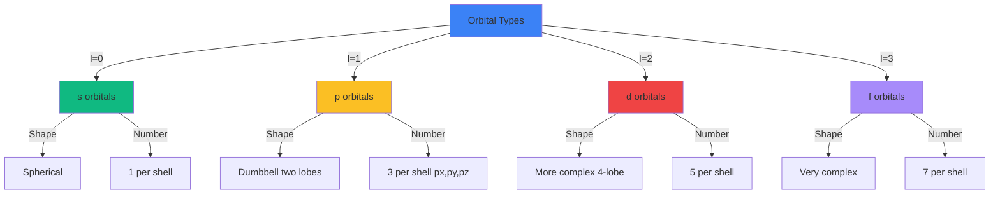

# Quantum Mechanical Atomic Model Tasks

Create advanced physics problems that explore the quantum mechanical description of atoms, moving beyond the Bohr model to the modern picture with wave functions, orbitals, and quantum numbers. Problems should help students understand the probabilistic nature of quantum mechanics, recognize the role of wave functions and orbitals, and connect quantum mechanics to atomic structure and the periodic table.

**Vary the problem structure:**
- **Bohr model limitations**: Identify failures - cannot explain multi-electron atoms, fine structure, chemical bonding, intensity of spectral lines, Zeeman effect
- **Wave function interpretation**: $|\psi(x,y,z)|^2$ gives probability density (probability per unit volume) of finding electron at position
- **Schrödinger equation (qualitative)**: Understand it's a wave equation for matter waves, solutions are wave functions $\psi$, eigenvalues are allowed energies
- **Quantum numbers**: Principal ($n = 1, 2, 3, ...$), angular momentum ($l = 0, 1, 2, ... n-1$), magnetic ($m_l = -l, ..., 0, ..., +l$), spin ($m_s = \pm\frac{1}{2}$)
- **Orbital notation**: s ($l=0$), p ($l=1$), d ($l=2$), f ($l=3$) - shapes and angular distributions
- **Energy levels**: For hydrogen, $E_n = -\frac{13.6 \text{ eV}}{n^2}$ (same as Bohr), but orbitals with same $n$ and different $l$ can have different energies in multi-electron atoms
- **Pauli exclusion principle**: No two electrons can have the same set of all four quantum numbers - explains shell structure
- **Electron configuration**: Build up electron configurations using aufbau principle: 1s, 2s, 2p, 3s, 3p, 4s, 3d, 4p, ...
- **Orbital shapes and nodes**: s orbitals spherical, p orbitals dumbbell-shaped, d orbitals more complex, nodes where $|\psi|^2 = 0$
- **Periodic table explanation**: Quantum numbers explain periods (shells) and groups (valence electrons), chemical properties from electron configuration
- **Spin quantum number**: Intrinsic angular momentum, not classical spinning, $m_s = +\frac{1}{2}$ (spin up) or $-\frac{1}{2}$ (spin down)

**Vary the content/context:**
- **Historical development**: Limitations of Bohr model → wave mechanics → Schrödinger equation (1926) → modern quantum mechanics
- **Hydrogen atom**: Only atom with exact analytical solution, spherical harmonics, Laguerre polynomials
- **Multi-electron atoms**: Electron-electron repulsion, screening, effective nuclear charge, orbital energy ordering changes
- **Atomic orbitals**: 1s, 2s, 2p, 3s, 3p, 3d, 4s, 4p, 4d, 4f - shapes, sizes, nodes
- **Electron configuration**: Ground state configurations, excited states, ions, valence electrons
- **Periodic table**: s-block (Groups 1-2), p-block (Groups 13-18), d-block (transition metals), f-block (lanthanides, actinides)
- **Chemical bonding**: Overlap of orbitals, hybridization (sp³, sp², sp), molecular orbitals
- **Spectroscopy**: Selection rules ($\Delta l = \pm 1$), allowed transitions, emission/absorption spectra
- **Quantum technology**: Atomic qubits in quantum computing, trapped ions, Rydberg atoms, optical lattices
- **Spin applications**: MRI (nuclear spin), electron spin resonance (ESR), spintronics

**Vary the complexity based on age:**
- **For younger ages** ({{age}} < 18): Qualitative orbital concepts, understand probability interpretation, basic quantum numbers, electron configurations for first 20 elements
- **For middle ages** ({{age}} 18): Quantum number relationships, orbital shapes, aufbau principle, Pauli principle, periodic table explanation, electron configurations including d and f blocks
- **For older ages** ({{age}} >= 19): Schrödinger equation (qualitative), radial and angular wave functions, quantum number derivations, selection rules, multi-electron effects, advanced configurations

**Use appropriate formats:**

**LaTeX for formulas:**
- Inline for relationships: Wave function $\psi(x,y,z,t)$, probability density $|\psi|^2$
- Block for fundamental concepts:

**Schrödinger equation (time-independent, qualitative form):**
$$\hat{H}\psi = E\psi$$

where:
- $\hat{H}$ = Hamiltonian operator (total energy operator)
- $\psi$ = wave function
- $E$ = energy eigenvalue

For hydrogen atom:
$$-\frac{\hbar^2}{2m_e}\nabla^2\psi - \frac{e^2}{4\pi\epsilon_0 r}\psi = E\psi$$

**Probability interpretation:**
$$P(\text{volume } dV) = |\psi(x,y,z)|^2 \, dV$$

The probability of finding the electron in a small volume $dV$ at position $(x,y,z)$.

**Normalization condition:**
$$\int_{all\ space} |\psi|^2 \, dV = 1$$

Total probability of finding electron somewhere is 1.

**Hydrogen energy levels:**
$$E_n = -\frac{13.6 \text{ eV}}{n^2} = -\frac{m_e e^4}{32\pi^2\epsilon_0^2\hbar^2 n^2} \quad (n = 1, 2, 3, ...)$$

Same as Bohr model, but interpretation is different - wave function solutions, not circular orbits.

**Quantum numbers and their ranges:**

**Principal quantum number:** $n = 1, 2, 3, 4, ...$ (shell)
- Determines energy (primarily) and size of orbital
- $n = 1, 2, 3, 4, ...$ corresponds to K, L, M, N, ... shells

**Angular momentum quantum number:** $l = 0, 1, 2, ..., (n-1)$ (subshell)
- Determines shape of orbital and magnitude of angular momentum
- $l = 0, 1, 2, 3, ...$ corresponds to s, p, d, f, ... orbitals
- Angular momentum magnitude: $L = \sqrt{l(l+1)} \, \hbar$

**Magnetic quantum number:** $m_l = -l, -l+1, ..., 0, ..., l-1, l$ (orientation)
- Determines spatial orientation of orbital
- For given $l$, there are $2l+1$ possible values of $m_l$
- Examples: s has 1 orientation, p has 3, d has 5, f has 7

**Spin quantum number:** $m_s = +\frac{1}{2}$ or $-\frac{1}{2}$ (spin up ↑ or down ↓)
- Intrinsic angular momentum, not related to spatial motion
- Spin angular momentum magnitude: $S = \sqrt{s(s+1)} \, \hbar$ where $s = \frac{1}{2}$ for electrons

**Pauli Exclusion Principle:**
No two electrons in an atom can have the same set of all four quantum numbers $(n, l, m_l, m_s)$.

**Maximum electrons per orbital/subshell:**
- Each orbital (specific $n, l, m_l$) can hold 2 electrons (opposite spins)
- Subshell with angular momentum $l$ has $2l+1$ orbitals, so max electrons = $2(2l+1)$
- Shell $n$ can hold maximum $2n^2$ electrons

**Tables for quantum numbers and orbitals:**

| $n$ | $l$ | Orbital | $m_l$ values | Number of orbitals | Max electrons |
|-----|-----|---------|-------------|-------------------|---------------|
| 1 | 0 | 1s | 0 | 1 | 2 |
| 2 | 0 | 2s | 0 | 1 | 2 |
| 2 | 1 | 2p | -1, 0, +1 | 3 | 6 |
| 3 | 0 | 3s | 0 | 1 | 2 |
| 3 | 1 | 3p | -1, 0, +1 | 3 | 6 |
| 3 | 2 | 3d | -2, -1, 0, +1, +2 | 5 | 10 |
| 4 | 0 | 4s | 0 | 1 | 2 |
| 4 | 1 | 4p | -1, 0, +1 | 3 | 6 |
| 4 | 2 | 4d | -2, -1, 0, +1, +2 | 5 | 10 |
| 4 | 3 | 4f | -3, -2, -1, 0, +1, +2, +3 | 7 | 14 |

**Orbital filling order (aufbau principle):**

1s → 2s → 2p → 3s → 3p → 4s → 3d → 4p → 5s → 4d → 5p → 6s → 4f → 5d → 6p → 7s → 5f → 6d → 7p

Note: 4s fills before 3d, 5s before 4d, 6s before 4f and 5d

**Electron configurations (examples):**

| Element | Z | Configuration | Valence | Notes |
|---------|---|--------------|---------|-------|
| H | 1 | 1s¹ | 1s¹ | |
| He | 2 | 1s² | 1s² | Noble gas |
| C | 6 | 1s² 2s² 2p² | 2s² 2p² | |
| N | 7 | 1s² 2s² 2p³ | 2s² 2p³ | Half-filled p |
| Ne | 10 | 1s² 2s² 2p⁶ | 2s² 2p⁶ | Noble gas |
| Na | 11 | [Ne] 3s¹ | 3s¹ | Alkali metal |
| Ar | 18 | [Ne] 3s² 3p⁶ | 3s² 3p⁶ | Noble gas |
| K | 19 | [Ar] 4s¹ | 4s¹ | 4s before 3d! |
| Sc | 21 | [Ar] 3d¹ 4s² | 3d¹ 4s² | First d-block |
| Fe | 26 | [Ar] 3d⁶ 4s² | 3d⁶ 4s² | Transition metal |
| Cu | 29 | [Ar] 3d¹⁰ 4s¹ | 3d¹⁰ 4s¹ | Exception (full d) |
| Kr | 36 | [Ar] 3d¹⁰ 4s² 4p⁶ | 4s² 4p⁶ | Noble gas |

**Periodic table structure from quantum mechanics:**

| Period | Shell $n$ | Available orbitals | Max electrons | Elements |
|--------|-----------|-------------------|---------------|----------|
| 1 | 1 | 1s | 2 | H, He |
| 2 | 2 | 2s, 2p | 8 | Li → Ne |
| 3 | 3 | 3s, 3p | 8 | Na → Ar |
| 4 | 4 | 4s, 3d, 4p | 18 | K → Kr |
| 5 | 5 | 5s, 4d, 5p | 18 | Rb → Xe |
| 6 | 6 | 6s, 4f, 5d, 6p | 32 | Cs → Rn |
| 7 | 7 | 7s, 5f, 6d, 7p | 32 | Fr → Og |

**Bohr model vs. Quantum mechanical model:**

| Aspect | Bohr Model | Quantum Mechanical Model |
|--------|------------|-------------------------|
| Electron location | Definite circular orbit | Probability distribution (orbital) |
| Trajectory | Well-defined path | No trajectory - uncertainty principle |
| Energy levels | Quantized (n) | Quantized (n, l, m_l, m_s) |
| Multi-electron atoms | Cannot explain | Explains through Pauli principle |
| Chemical bonding | No explanation | Orbital overlap, hybridization |
| Orbital shapes | Circular only | s, p, d, f - diverse shapes |
| Angular momentum | $L = n\hbar$ | $L = \sqrt{l(l+1)}\hbar$ |
| Ground state (H) | $l = n\hbar$ ≠ 0 | $l = 0$ possible (s orbital) |
| Fine structure | Cannot explain | Requires relativistic QM |

**Mermaid diagrams for quantum atomic model:**

```mermaid
graph TD
    A[Bohr Model 1913] -->|Success| B[Explains H spectrum]
    A -->|Failures| C[Cannot explain He, Li, ...]
    A -->|Failures| D[Cannot explain bonding]
    A -->|Failures| E[Cannot explain intensities]

    F[Wave Mechanics 1926] -->|Schrödinger equation| G[Wave functions ψ]
    G -->|Interpretation| H[Probability density |ψ|²]
    H -->|Solutions| I[Atomic orbitals]

    I -->|Quantum numbers| J[n, l, m_l, m_s]
    J -->|Restrictions| K[Pauli principle]
    K -->|Explains| L[Periodic table structure]
    K -->|Explains| M[Chemical properties]

    style A fill:#fbbf24
    style F fill:#10b981
    style L fill:#3b82f6
    style M fill:#3b82f6
```





**SVG diagrams for quantum atomic visualization:**

Use SVG to show:
- Comparison: Bohr orbit (definite circle) vs. quantum orbital (probability cloud)
- s orbital: spherical probability distribution, radial nodes for 2s, 3s
- p orbitals: dumbbell shapes, three orientations px, py, pz perpendicular to each other
- d orbitals: complex shapes, five orientations
- Electron configuration diagram: energy levels with boxes representing orbitals, arrows for electrons
- Aufbau principle: filling order with arrows showing electron placement
- Pauli exclusion: two electrons per orbital with opposite spins
- Periodic table blocks: s-block, p-block, d-block, f-block highlighted

Example SVG for Bohr vs. Quantum:
```svg
<svg viewBox="0 0 600 400" xmlns="http://www.w3.org/2000/svg">
  <!-- Bohr Model -->
  <text x="50" y="30" font-size="15" font-weight="bold">Bohr Model</text>

  <!-- Nucleus -->
  <circle cx="150" cy="120" r="10" fill="#ef4444"/>
  <text x="143" y="125" font-size="10" fill="white">+e</text>

  <!-- Definite orbit -->
  <circle cx="150" cy="120" r="60" fill="none" stroke="#3b82f6" stroke-width="2"/>

  <!-- Electron on orbit -->
  <circle cx="210" cy="120" r="5" fill="#3b82f6"/>
  <text x="200" y="110" font-size="11">e⁻</text>

  <!-- Arrow showing motion -->
  <path d="M 190 70 Q 200 60, 210 70" fill="none" stroke="#10b981" stroke-width="2" marker-end="url(#arrow)"/>
  <text x="180" y="55" font-size="10" fill="#10b981">Definite path</text>

  <text x="100" y="200" font-size="12">• Electron in definite orbit</text>
  <text x="100" y="217" font-size="12">• Circular trajectory</text>
  <text x="100" y="234" font-size="12">• Precise position & momentum</text>

  <!-- Quantum Model -->
  <text x="350" y="30" font-size="15" font-weight="bold">Quantum Model</text>

  <!-- Nucleus -->
  <circle cx="450" cy="120" r="10" fill="#ef4444"/>
  <text x="443" y="125" font-size="10" fill="white">+e</text>

  <!-- Probability cloud (orbital) -->
  <circle cx="450" cy="120" r="50" fill="#3b82f6" opacity="0.3"/>
  <circle cx="450" cy="120" r="35" fill="#3b82f6" opacity="0.4"/>
  <circle cx="450" cy="120" r="20" fill="#3b82f6" opacity="0.5"/>

  <!-- High probability region annotation -->
  <circle cx="480" cy="130" r="3" fill="#fbbf24"/>
  <text x="485" y="135" font-size="10" fill="#fbbf24">High |ψ|²</text>

  <text x="400" y="200" font-size="12">• Electron probability cloud</text>
  <text x="400" y="217" font-size="12">• No definite trajectory</text>
  <text x="400" y="234" font-size="12">• Uncertainty principle applies</text>

  <!-- Bottom comparison -->
  <rect x="50" y="260" width="500" height="120" fill="#fef3c7" stroke="#fbbf24" stroke-width="2" rx="5"/>
  <text x="60" y="285" font-size="14" font-weight="bold">Key Difference:</text>
  <text x="60" y="305" font-size="12">Bohr: "Where IS the electron?" → At this point on orbit</text>
  <text x="60" y="325" font-size="12">Quantum: "Where IS the electron?" → Question is meaningless!</text>
  <text x="60" y="345" font-size="12">Better question: "Where might we FIND the electron?" → Probability |ψ|²</text>
  <text x="60" y="365" font-size="11" style="font-style:italic">The electron doesn't have a definite position until measured!</text>

  <defs>
    <marker id="arrow" markerWidth="10" markerHeight="10" refX="9" refY="3" orient="auto">
      <polygon points="0 0, 10 3, 0 6" fill="#10b981" />
    </marker>
  </defs>
</svg>
```

Example SVG for orbital shapes:
```svg
<svg viewBox="0 0 700 350" xmlns="http://www.w3.org/2000/svg">
  <!-- Title -->
  <text x="250" y="25" font-size="16" font-weight="bold">Atomic Orbital Shapes</text>

  <!-- s orbital (spherical) -->
  <text x="70" y="60" font-size="14" font-weight="bold">s orbital (l=0)</text>
  <circle cx="100" cy="120" r="5" fill="#ef4444"/>
  <text x="93" y="125" font-size="9" fill="white">+</text>
  <circle cx="100" cy="120" r="40" fill="#3b82f6" opacity="0.4"/>
  <text x="70" y="180" font-size="11">Spherical</text>
  <text x="65" y="195" font-size="11">1 orientation</text>

  <!-- p orbitals (dumbbell) -->
  <text x="210" y="60" font-size="14" font-weight="bold">p orbitals (l=1)</text>

  <!-- px -->
  <circle cx="250" cy="120" r="5" fill="#ef4444"/>
  <ellipse cx="225" cy="120" rx="22" ry="35" fill="#10b981" opacity="0.5"/>
  <ellipse cx="275" cy="120" rx="22" ry="35" fill="#10b981" opacity="0.5"/>
  <text x="240" y="165" font-size="10">p_x</text>

  <!-- py -->
  <circle cx="320" cy="120" r="5" fill="#ef4444"/>
  <ellipse cx="320" cy="95" rx="35" ry="22" fill="#10b981" opacity="0.5"/>
  <ellipse cx="320" cy="145" rx="35" ry="22" fill="#10b981" opacity="0.5"/>
  <text x="310" y="185" font-size="10">p_y</text>

  <!-- pz -->
  <circle cx="390" cy="120" r="5" fill="#ef4444"/>
  <ellipse cx="390" cy="95" rx="22" ry="35" fill="#10b981" opacity="0.5" transform="rotate(45 390 120)"/>
  <ellipse cx="390" cy="145" rx="22" ry="35" fill="#10b981" opacity="0.5" transform="rotate(45 390 120)"/>
  <text x="380" y="165" font-size="10">p_z</text>

  <text x="230" y="205" font-size="11">Dumbbell (2 lobes)</text>
  <text x="230" y="220" font-size="11">3 orientations (x,y,z)</text>

  <!-- d orbitals (complex) -->
  <text x="490" y="60" font-size="14" font-weight="bold">d orbitals (l=2)</text>

  <!-- Simplified d orbital representation -->
  <circle cx="550" cy="120" r="5" fill="#ef4444"/>
  <ellipse cx="530" cy="100" rx="15" ry="25" fill="#fbbf24" opacity="0.5" transform="rotate(45 530 100)"/>
  <ellipse cx="570" cy="100" rx="15" ry="25" fill="#fbbf24" opacity="0.5" transform="rotate(-45 570 100)"/>
  <ellipse cx="530" cy="140" rx="15" ry="25" fill="#fbbf24" opacity="0.5" transform="rotate(-45 530 140)"/>
  <ellipse cx="570" cy="140" rx="15" ry="25" fill="#fbbf24" opacity="0.5" transform="rotate(45 570 140)"/>

  <text x="510" y="185" font-size="11">Complex shapes</text>
  <text x="510" y="200" font-size="11">5 orientations</text>

  <!-- Bottom info -->
  <rect x="50" y="240" width="600" height="90" fill="#e0f2fe" stroke="#3b82f6" stroke-width="2" rx="5"/>
  <text x="60" y="265" font-size="13" font-weight="bold">Orbital Characteristics:</text>
  <text x="60" y="285" font-size="11">• Each type (s, p, d, f) has characteristic shape determined by angular quantum number l</text>
  <text x="60" y="302" font-size="11">• |ψ|² (probability density) is highest where shading is darkest</text>
  <text x="60" y="319" font-size="11">• Each orbital can hold maximum 2 electrons (spin up ↑ and spin down ↓)</text>
</svg>
```

Example SVG for electron configuration:
```svg
<svg viewBox="0 0 550 450" xmlns="http://www.w3.org/2000/svg">
  <!-- Title -->
  <text x="150" y="25" font-size="15" font-weight="bold">Electron Configuration: Carbon (Z=6)</text>

  <!-- Energy level diagram -->
  <text x="30" y="70" font-size="12">Energy</text>
  <line x1="50" y1="380" x2="50" y2="60" stroke="black" stroke-width="2" marker-end="url(#arrow-up)"/>

  <!-- 1s -->
  <line x1="100" y1="350" x2="200" y2="350" stroke="black" stroke-width="2"/>
  <text x="70" y="355" font-size="13">1s</text>
  <rect x="120" y="340" width="25" height="25" fill="none" stroke="black" stroke-width="1"/>
  <text x="127" y="357" font-size="18">↑↓</text>

  <!-- 2s -->
  <line x1="100" y1="270" x2="200" y2="270" stroke="black" stroke-width="2"/>
  <text x="70" y="275" font-size="13">2s</text>
  <rect x="120" y="260" width="25" height="25" fill="none" stroke="black" stroke-width="1"/>
  <text x="127" y="277" font-size="18">↑↓</text>

  <!-- 2p -->
  <line x1="100" y1="210" x2="300" y2="210" stroke="black" stroke-width="2"/>
  <text x="70" y="215" font-size="13">2p</text>
  <rect x="120" y="200" width="25" height="25" fill="none" stroke="black" stroke-width="1"/>
  <text x="127" y="217" font-size="18">↑</text>
  <rect x="155" y="200" width="25" height="25" fill="none" stroke="black" stroke-width="1"/>
  <text x="162" y="217" font-size="18">↑</text>
  <rect x="190" y="200" width="25" height="25" fill="none" stroke="black" stroke-width="1"/>

  <!-- Configuration notation -->
  <text x="320" y="355" font-size="14" font-weight="bold">1s²</text>
  <text x="370" y="355" font-size="12">(2 electrons)</text>
  <text x="320" y="275" font-size="14" font-weight="bold">2s²</text>
  <text x="370" y="275" font-size="12">(2 electrons)</text>
  <text x="320" y="215" font-size="14" font-weight="bold">2p²</text>
  <text x="370" y="215" font-size="12">(2 electrons)</text>

  <!-- Full configuration -->
  <rect x="80" y="380" width="420" height="50" fill="#fef3c7" stroke="#fbbf24" stroke-width="2" rx="5"/>
  <text x="90" y="405" font-size="14" font-weight="bold">Full configuration: 1s² 2s² 2p²</text>
  <text x="90" y="422" font-size="12">Total: 2 + 2 + 2 = 6 electrons</text>

  <!-- Rules box -->
  <rect x="50" y="240" width="450" height="110" fill="#e0f2fe" stroke="#3b82f6" stroke-width="2" rx="5"/>
  <text x="60" y="265" font-size="13" font-weight="bold">Filling Rules (Aufbau Principle):</text>
  <text x="60" y="285" font-size="11">1. Fill orbitals from lowest to highest energy</text>
  <text x="60" y="302" font-size="11">2. Each orbital holds max 2 electrons with opposite spins (Pauli principle)</text>
  <text x="60" y="319" font-size="11">3. Within a subshell, put one electron in each orbital before pairing (Hund's rule)</text>
  <text x="60" y="336" font-size="11">   → That's why 2p² has two separate ↑ electrons, not one ↑↓ pair</text>

  <defs>
    <marker id="arrow-up" markerWidth="10" markerHeight="10" refX="5" refY="2" orient="auto">
      <polygon points="0 10, 10 10, 5 0" fill="black" />
    </marker>
  </defs>
</svg>
```

**Adjust difficulty with {{difficulty}}:**
- **Easy**: Understand orbital vs. orbit, probability interpretation qualitative, identify quantum numbers for simple orbitals (1s, 2p, 3d), basic electron configurations (H to Ne)
- **Medium**: Apply quantum number rules, determine allowed/forbidden quantum number sets, electron configurations including d-block, explain periodic table structure, orbital shapes qualitative
- **Hard**: Schrödinger equation qualitative understanding, selection rules, multi-electron effects, advanced configurations (exceptions like Cu, Cr), bonding from orbital overlap, quantum measurement paradoxes

**Include variety in numerical values:**
- Atomic numbers: 1-36 (H to Kr), selected heavier elements
- Quantum numbers: Practice all combinations, identify valid vs. invalid sets
- Electron configurations: Ground states, excited states, ions (cations, anions)
- Energy calculations: Using $E_n = -13.6 \text{ eV}/n^2$ for hydrogen
- Shell capacities: Calculate maximum electrons for shells n=1,2,3,4
- Orbital counts: Number of orbitals for given l, number of electrons for given subshell
- Ensure problems connect quantum mechanics to chemistry (bonding, reactivity, periodic properties)
- Include historical context and limitations of earlier models
