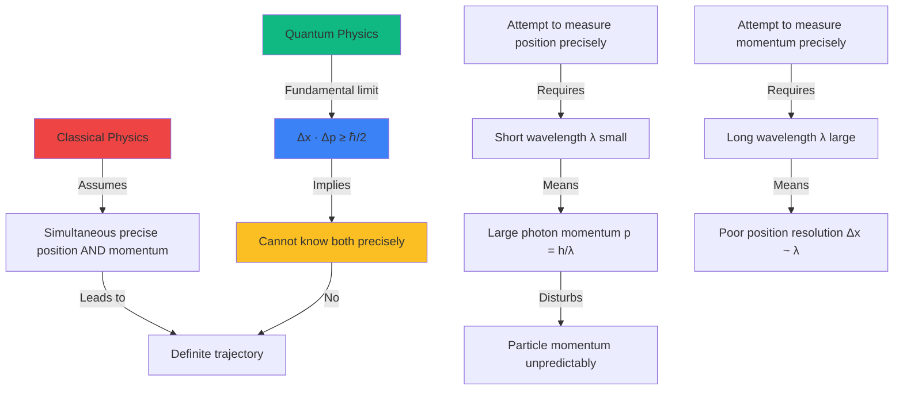
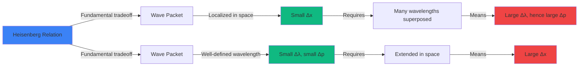
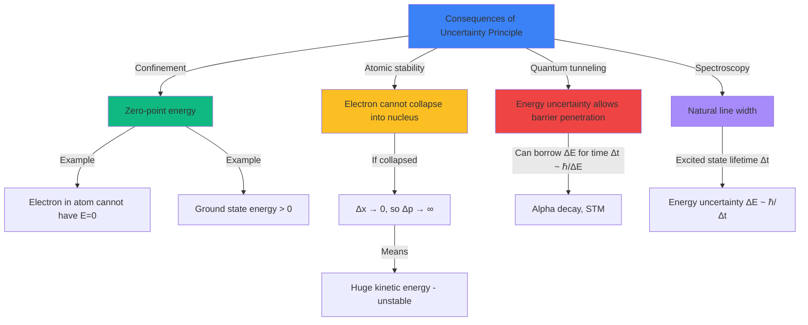

# Uncertainty Principle Tasks

Create advanced physics problems that explore Heisenberg's uncertainty principle and its fundamental role in quantum mechanics. Problems should help students understand that uncertainty is not a measurement limitation but a fundamental property of nature, apply uncertainty relations quantitatively, and recognize the quantum-classical boundary.

**Vary the problem structure:**
- **Position-momentum uncertainty**: Apply $\Delta x \cdot \Delta p \geq \frac{\hbar}{2}$ where $\hbar = \frac{h}{2\pi} = 1.055 \times 10^{-34}$ J·s (reduced Planck constant)
- **Velocity uncertainty**: From momentum uncertainty $\Delta p = m \cdot \Delta v$, derive $\Delta x \cdot \Delta v \geq \frac{\hbar}{2m}$
- **Energy-time uncertainty**: Apply $\Delta E \cdot \Delta t \geq \frac{\hbar}{2}$ for energy uncertainty in time interval
- **Minimum uncertainty states**: Equality holds ($\Delta x \cdot \Delta p = \frac{\hbar}{2}$) for Gaussian wave packets, minimum uncertainty
- **Wave packet analysis**: Narrow wave packet (small $\Delta x$) requires many wavelengths (large $\Delta p$), and vice versa
- **Electron in atom**: Estimate minimum kinetic energy from confinement (Bohr radius scale)
- **Measurement disturbance**: Explain how precise position measurement (short wavelength photon) necessarily transfers large momentum
- **Zero-point energy**: Explain why confined quantum systems cannot have zero energy (ground state must have $E > 0$)
- **Quantum tunneling**: Uncertainty principle allows particle to "borrow" energy $\Delta E$ for time $\Delta t \approx \frac{\hbar}{2\Delta E}$
- **Natural line width**: Energy uncertainty of excited atomic states leads to spectral line broadening $\Delta f = \frac{\Delta E}{h}$

**Vary the content/context:**
- **Electron confinement**: Electron in atom, electron in quantum dot, electron in nucleus-sized region
- **Measurement thought experiments**: Heisenberg's gamma-ray microscope, double-slit with which-path detection
- **Atomic stability**: Why electron doesn't collapse into nucleus - uncertainty principle prevents it
- **Quantum tunneling**: Alpha decay, scanning tunneling microscope, quantum tunneling in electronics
- **Spectroscopy**: Natural line width of spectral lines, excited state lifetimes, uncertainty broadening
- **Particle accelerators**: Beam focus vs. momentum spread tradeoffs
- **Quantum computing**: Qubit decoherence times, measurement-induced collapse
- **Fundamental limits**: Best possible precision in position-momentum measurements, limits of microscopy
- **Vacuum fluctuations**: Virtual particle-antiparticle pairs "borrowing" energy for brief times
- **Macroscopic comparison**: Show uncertainty negligible for everyday objects

**Vary the complexity based on age:**
- **For younger ages** ({{age}} < 18): Basic uncertainty calculations, understand qualitative meaning, apply to simple confinement scenarios
- **For middle ages** ({{age}} 18): Quantitative uncertainty problems with various units, energy-time relation, explain measurement limitations, atomic applications
- **For older ages** ({{age}} >= 19): Wave packet analysis, derive consequences (zero-point energy, tunneling), philosophical implications, quantum measurement theory, Copenhagen interpretation

**Use appropriate formats:**

**LaTeX for formulas:**
- Inline for relationships: Position-momentum uncertainty $\Delta x \cdot \Delta p \geq \frac{\hbar}{2}$
- Block for fundamental relations:

**Heisenberg Uncertainty Principle (position-momentum):**
$$\Delta x \cdot \Delta p \geq \frac{\hbar}{2}$$

where:
- $\Delta x$ = uncertainty in position (m)
- $\Delta p$ = uncertainty in momentum (kg·m/s)
- $\hbar = \frac{h}{2\pi} = 1.055 \times 10^{-34}$ J·s (reduced Planck constant)

**Alternative form (velocity uncertainty):**
$$\Delta x \cdot \Delta v \geq \frac{\hbar}{2m}$$

where $\Delta v$ = uncertainty in velocity and $m$ = mass.

**Energy-time uncertainty:**
$$\Delta E \cdot \Delta t \geq \frac{\hbar}{2}$$

where:
- $\Delta E$ = uncertainty in energy (J)
- $\Delta t$ = time interval (s)

This relates:
- Lifetime of excited state ($\Delta t$) to natural line width ($\Delta E$)
- "Borrowing" energy for quantum processes
- Measurement time vs. energy precision

**Minimum uncertainty (Gaussian wave packets):**
$$\Delta x \cdot \Delta p = \frac{\hbar}{2} \quad \text{(minimum, ideal case)}$$

**Typical order of magnitude estimate:**
$$\Delta x \cdot \Delta p \sim \hbar$$

or

$$\Delta E \cdot \Delta t \sim \hbar$$

**Zero-point energy argument:**

For particle confined to size $L$: $\Delta x \sim L$

Minimum momentum: $\Delta p \sim \frac{\hbar}{2\Delta x} = \frac{\hbar}{2L}$

Minimum kinetic energy:
$$E_{kin,min} \sim \frac{(\Delta p)^2}{2m} \sim \frac{\hbar^2}{8mL^2}$$

This explains why confined quantum systems cannot have exactly zero energy.

**Tables for typical scales:**

**Constants:**
| Constant | Symbol | Value | Units |
|----------|--------|-------|-------|
| Planck constant | $h$ | 6.626 × 10⁻³⁴ | J·s |
| Reduced Planck constant | $\hbar$ | 1.055 × 10⁻³⁴ | J·s |
| Reduced Planck constant | $\hbar$ | 6.582 × 10⁻¹⁶ | eV·s |

**Quantum vs. Classical scales:**
| System | Size $\Delta x$ | Momentum scale $\Delta p$ | $\Delta x \cdot \Delta p$ | Quantum? |
|--------|----------------|-------------------------|------------------------|----------|
| Electron in atom | ~10⁻¹⁰ m | ~10⁻²⁴ kg·m/s | ~10⁻³⁴ | YES |
| Electron in dot | ~10⁻⁹ m | ~10⁻²⁵ kg·m/s | ~10⁻³⁴ | YES |
| Proton in nucleus | ~10⁻¹⁵ m | ~10⁻¹⁹ kg·m/s | ~10⁻³⁴ | YES |
| Molecule | ~10⁻⁹ m | ~10⁻²⁴ kg·m/s | ~10⁻³³ | YES |
| Dust particle | ~10⁻⁶ m | ~10⁻¹⁴ kg·m/s | ~10⁻²⁰ | NO |
| Tennis ball | ~0.1 m | ~1 kg·m/s | ~0.1 | NO |

When $\Delta x \cdot \Delta p \gg \hbar$, quantum effects are negligible.

**Example calculations:**

**Electron confined to 1 nm:**
- $\Delta x = 1 \times 10^{-9}$ m
- $\Delta p \geq \frac{\hbar}{2\Delta x} = \frac{1.055 \times 10^{-34}}{2 \times 10^{-9}} = 5.3 \times 10^{-26}$ kg·m/s
- $\Delta v \geq \frac{\Delta p}{m_e} = \frac{5.3 \times 10^{-26}}{9.1 \times 10^{-31}} \approx 5.8 \times 10^4$ m/s
- Minimum kinetic energy: $E_{kin} \sim \frac{(\Delta p)^2}{2m_e} \approx 1.5 \times 10^{-21}$ J ≈ 0.01 eV

**Excited atom lifetime:**
- Lifetime $\Delta t = 10^{-8}$ s (typical)
- Energy uncertainty: $\Delta E \geq \frac{\hbar}{2\Delta t} = \frac{1.055 \times 10^{-34}}{2 \times 10^{-8}} = 5.3 \times 10^{-27}$ J
- $\Delta E \approx 3.3 \times 10^{-8}$ eV
- Frequency uncertainty: $\Delta f = \frac{\Delta E}{h} \approx 8 \times 10^6$ Hz = 8 MHz (natural line width)

**Mermaid diagrams for uncertainty principle:**







**SVG diagrams for uncertainty visualization:**

Use SVG to show:
- Wave packet visualization: narrow packet (small Δx, many wavelengths, large Δp) vs. extended packet (large Δx, few wavelengths, small Δp)
- Position-momentum tradeoff graph: as Δx decreases, Δp increases maintaining Δx·Δp ≥ ℏ/2
- Measurement thought experiment: photon scattering to measure electron position disturbs momentum
- Energy level diagram showing natural line width from uncertainty principle
- Comparison of quantum uncertainty (fundamental) vs. classical measurement error (technical)
- Zero-point energy: particle in box cannot have zero energy due to confinement

Example SVG for wave packet comparison:
```svg
<svg viewBox="0 0 600 450" xmlns="http://www.w3.org/2000/svg">
  <!-- Title -->
  <text x="150" y="25" font-size="16" font-weight="bold">Wave Packets and Uncertainty</text>

  <!-- Localized wave packet (small Δx, large Δp) -->
  <text x="50" y="70" font-size="14" font-weight="bold">Localized: Small Δx</text>

  <!-- Narrow wave packet with many wavelengths -->
  <path d="M 50 120 Q 60 100, 70 120 T 90 120 T 110 120 T 130 120 T 150 120 T 170 120 T 190 120 T 210 120 T 230 120 T 250 120"
        fill="none" stroke="#3b82f6" stroke-width="2"/>

  <!-- Envelope (Gaussian) -->
  <path d="M 50 120 Q 150 80, 250 120"
        fill="none" stroke="#ef4444" stroke-width="2" stroke-dasharray="5,5"/>
  <path d="M 50 120 Q 150 160, 250 120"
        fill="none" stroke="#ef4444" stroke-width="2" stroke-dasharray="5,5"/>

  <!-- Position uncertainty marker -->
  <line x1="100" y1="180" x2="200" y2="180" stroke="#10b981" stroke-width="3"/>
  <line x1="100" y1="175" x2="100" y2="185" stroke="#10b981" stroke-width="3"/>
  <line x1="200" y1="175" x2="200" y2="185" stroke="#10b981" stroke-width="3"/>
  <text x="130" y="200" font-size="13" fill="#10b981" font-weight="bold">Small Δx</text>

  <!-- Wavelength indication -->
  <line x1="130" y1="100" x2="150" y2="100" stroke="#fbbf24" stroke-width="2"/>
  <text x="155" y="105" font-size="11" fill="#fbbf24">λ small</text>
  <text x="50" y="225" font-size="12">Many wavelengths → Large Δλ → </text>
  <text x="50" y="242" font-size="12" font-weight="bold" fill="#ef4444">Large Δp</text>

  <!-- Extended wave packet (large Δx, small Δp) -->
  <text x="50" y="300" font-size="14" font-weight="bold">Extended: Large Δx</text>

  <!-- Extended wave packet with few wavelengths -->
  <path d="M 50 350 Q 100 320, 150 350 T 250 350 T 350 350 T 450 350 T 550 350"
        fill="none" stroke="#3b82f6" stroke-width="2"/>

  <!-- Envelope (Gaussian) -->
  <path d="M 50 350 Q 300 310, 550 350"
        fill="none" stroke="#ef4444" stroke-width="2" stroke-dasharray="5,5"/>
  <path d="M 50 350 Q 300 390, 550 350"
        fill="none" stroke="#ef4444" stroke-width="2" stroke-dasharray="5,5"/>

  <!-- Position uncertainty marker -->
  <line x1="100" y1="410" x2="500" y2="410" stroke="#10b981" stroke-width="3"/>
  <line x1="100" y1="405" x2="100" y2="415" stroke="#10b981" stroke-width="3"/>
  <line x1="500" y1="405" x2="500" y2="415" stroke="#10b981" stroke-width="3"/>
  <text x="270" y="430" font-size="13" fill="#10b981" font-weight="bold">Large Δx</text>

  <!-- Wavelength indication -->
  <line x1="150" y1="330" x2="250" y2="330" stroke="#fbbf24" stroke-width="2"/>
  <text x="255" y="335" font-size="11" fill="#fbbf24">λ large</text>
  <text x="320" y="300" font-size="12">Few wavelengths → Small Δλ →</text>
  <text x="320" y="317" font-size="12" font-weight="bold" fill="#10b981">Small Δp</text>

  <!-- Fundamental relation -->
  <rect x="380" y="40" width="200" height="50" fill="#fef3c7" stroke="#fbbf24" stroke-width="2"/>
  <text x="405" y="63" font-size="14" font-weight="bold">Δx · Δp ≥ ℏ/2</text>
  <text x="395" y="80" font-size="11">Cannot minimize both!</text>
</svg>
```

Example SVG for measurement disturbance:
```svg
<svg viewBox="0 0 600 400" xmlns="http://www.w3.org/2000/svg">
  <!-- Title -->
  <text x="120" y="25" font-size="15" font-weight="bold">Heisenberg's Gamma-Ray Microscope Thought Experiment</text>

  <!-- Electron (before measurement) -->
  <circle cx="300" cy="250" r="8" fill="#3b82f6"/>
  <text x="285" y="280" font-size="13">e⁻</text>
  <text x="320" y="255" font-size="12">Position unknown</text>

  <!-- Incoming photon (short wavelength for precise position) -->
  <line x1="200" y1="150" x2="295" y2="245" stroke="#fbbf24" stroke-width="3" marker-end="url(#arrow)"/>
  <text x="210" y="140" font-size="12" fill="#fbbf24">Photon γ</text>
  <text x="205" y="155" font-size="11" fill="#fbbf24">λ small (short)</text>
  <text x="190" y="170" font-size="11" fill="#fbbf24">→ precise position</text>

  <!-- Scattered photon -->
  <line x1="305" y1="245" x2="400" y2="150" stroke="#fbbf24" stroke-width="2" stroke-dasharray="4,4"/>
  <text x="360" y="180" font-size="11" fill="#fbbf24">Scattered photon</text>
  <text x="350" y="195" font-size="11" fill="#fbbf24">(detected here)</text>

  <!-- Electron after collision (momentum changed) -->
  <circle cx="350" cy="280" r="8" fill="#ef4444"/>
  <line x1="308" y1="250" x2="345" y2="275" stroke="#ef4444" stroke-width="3" marker-end="url(#arrow-red)"/>
  <text x="320" y="310" font-size="12" fill="#ef4444">Momentum disturbed!</text>
  <text x="315" y="325" font-size="11" fill="#ef4444">Δp ~ h/λ (large!)</text>

  <!-- Explanation box -->
  <rect x="50" y="330" width="500" height="60" fill="#fef3c7" stroke="#fbbf24" stroke-width="2" rx="5"/>
  <text x="60" y="350" font-size="12" font-weight="bold">Fundamental Tradeoff:</text>
  <text x="60" y="367" font-size="11">• Short λ photon → Precise position measurement (small Δx)</text>
  <text x="60" y="382" font-size="11">• But short λ → Large photon momentum p=h/λ → Large momentum transfer Δp</text>

  <defs>
    <marker id="arrow" markerWidth="10" markerHeight="10" refX="9" refY="3" orient="auto">
      <polygon points="0 0, 10 3, 0 6" fill="#fbbf24" />
    </marker>
    <marker id="arrow-red" markerWidth="10" markerHeight="10" refX="9" refY="3" orient="auto">
      <polygon points="0 0, 10 3, 0 6" fill="#ef4444" />
    </marker>
  </defs>
</svg>
```

Example SVG for zero-point energy:
```svg
<svg viewBox="0 0 500 400" xmlns="http://www.w3.org/2000/svg">
  <!-- Title -->
  <text x="100" y="30" font-size="15" font-weight="bold">Zero-Point Energy from Uncertainty Principle</text>

  <!-- Potential well (box) -->
  <line x1="100" y1="150" x2="100" y2="300" stroke="black" stroke-width="5"/>
  <line x1="100" y1="300" x2="400" y2="300" stroke="black" stroke-width="5"/>
  <line x1="400" y1="300" x2="400" y2="150" stroke="black" stroke-width="5"/>
  <text x="220" y="330" font-size="13">Confinement size L</text>

  <!-- Classical E=0 (crossed out) -->
  <line x1="100" y1="295" x2="400" y2="295" stroke="#ef4444" stroke-width="2" stroke-dasharray="5,5"/>
  <text x="410" y="300" font-size="12" fill="#ef4444">E = 0</text>
  <line x1="90" y1="280" x2="140" y2="310" stroke="#ef4444" stroke-width="4"/>
  <line x1="90" y1="310" x2="140" y2="280" stroke="#ef4444" stroke-width="4"/>
  <text x="150" y="300" font-size="11" fill="#ef4444">Forbidden!</text>

  <!-- Ground state (E > 0) -->
  <line x1="100" y1="250" x2="400" y2="250" stroke="#10b981" stroke-width="2"/>
  <text x="410" y="255" font-size="12" fill="#10b981">E_min > 0</text>

  <!-- Wave function -->
  <path d="M 100 250 Q 250 200, 400 250"
        fill="none" stroke="#3b82f6" stroke-width="2"/>
  <text x="220" y="190" font-size="12" fill="#3b82f6">ψ(x)</text>

  <!-- Reasoning box -->
  <rect x="50" y="60" width="400" height="80" fill="#e0f2fe" stroke="#3b82f6" stroke-width="2" rx="5"/>
  <text x="60" y="80" font-size="12" font-weight="bold">Why E > 0 always?</text>
  <text x="60" y="100" font-size="11">1. Confined to size L → Position uncertainty: Δx ~ L</text>
  <text x="60" y="115" font-size="11">2. Uncertainty principle: Δp ≥ ℏ/(2Δx) = ℏ/(2L)</text>
  <text x="60" y="130" font-size="11">3. Kinetic energy: E_kin ~ (Δp)²/(2m) ~ ℏ²/(8mL²) > 0</text>

  <!-- Conclusion box -->
  <rect x="50" y="340" width="400" height="45" fill="#fef3c7" stroke="#fbbf24" stroke-width="2" rx="5"/>
  <text x="60" y="360" font-size="12" font-weight="bold">Consequence: Zero-point energy</text>
  <text x="60" y="377" font-size="11">Confined quantum systems CANNOT have exactly zero energy!</text>
</svg>
```

**Adjust difficulty with {{difficulty}}:**
- **Easy**: Basic uncertainty calculations (given Δx find minimum Δp, or vice versa), understand qualitative meaning, recognize fundamental vs. technical limitations
- **Medium**: Calculate minimum uncertainties in various units, energy-time relation, estimate zero-point energies, natural line width calculations
- **Hard**: Wave packet analysis, derive consequences (atomic stability, tunneling), philosophical implications, measurement theory, combined uncertainty relations

**Include variety in numerical values:**
- Position uncertainties: 0.1 nm, 0.5 nm, 1 nm, 10 nm, 1 μm (quantum dot), 10⁻¹⁵ m (nucleus)
- Time intervals: 10⁻⁸ s (excited state), 10⁻¹⁵ s (femtosecond laser), 10⁻²³ s (nuclear state)
- Particle masses: electron (9.1 × 10⁻³¹ kg), proton (1.67 × 10⁻²⁷ kg), neutron, atoms
- Confinement sizes: Bohr radius (0.05 nm), quantum dot (10 nm), atomic nucleus (10⁻¹⁵ m)
- Energy uncertainties: 10⁻⁶ eV (spectral line), 10⁻³ eV, 1 eV, 1 MeV
- Always compare quantum uncertainty (ℏ scale) with macroscopic situations to show negligibility
- Include unit conversion practice: J ↔ eV, Hz ↔ J, nm ↔ m
- Ensure problems demonstrate fundamental nature of uncertainty, not measurement technique
